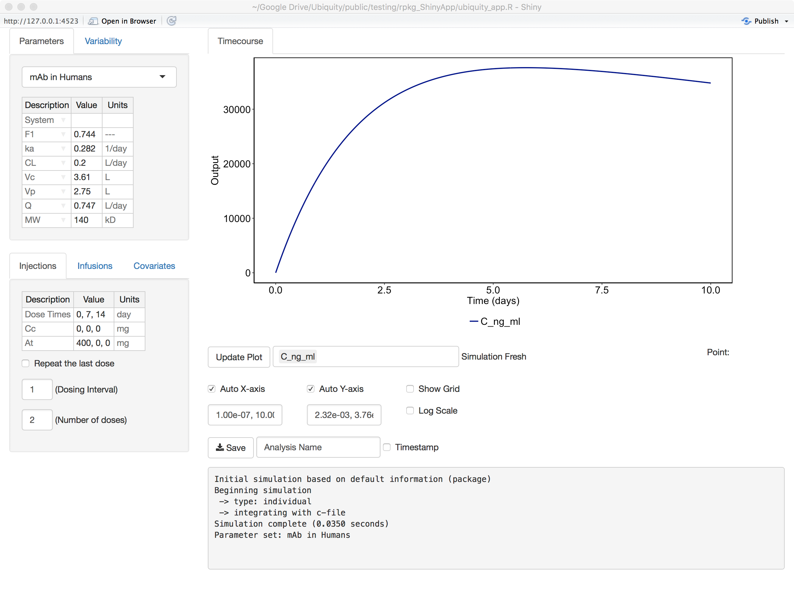
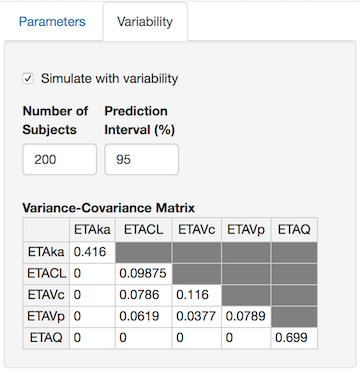
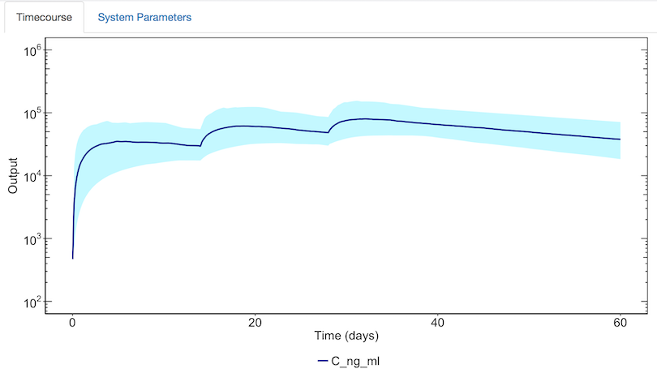
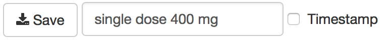

```{r setup, include=FALSE}
knitr::opts_chunk$set(echo = TRUE, message=FALSE, eval=FALSE)
require(ubiquity)
require(deSolve)
require(ggplot2)
require(foreach)
require(doParallel)
require(rhandsontable)
```


## Introduction

Once a model has been developed it may be useful to provide an easy way to run simulations or automate specific analyses. Do to that, a ubiquity provides a ShinyApp that allows the model to be run from an easy to use interface that is highly customizable. This App can be run locally (useful during meetings to answer quick questions) or deployed on a Shiny server to allow others access to the model.

To demonstrate this interface we can begin with the PK model of mAbs in humans ([Davda etal. mAbs, 6(4), 1094-1102](https://doi.org/10.4161/mabs.29095)) :

```{r results="hide", message=FALSE, echo=TRUE}
library(ubiquity)
system_new(file_name = "system.txt", system_file = "mab_pk", overwrite = TRUE)
cfg = build_system(system_file = "system.txt")
```

Use ``?system_new`` to see a list of the available system file examples. After building any system you can then create the ShinyApp template:

```{r eval=FALSE}
system_fetch_template(cfg, template = "ShinyApp", overwrite = TRUE)
```

This should create the following three files:

* ``ubiquity_app.R`` - Script to run and control ubiquity ShinyApp
* ``server.R`` - Server script
* ``ui.R``- UI script

## Running the model

Next simply open ``ubiquity_app.R`` in RStudio and source it, and RStudio will open in a window associated with that application. The ShinyApp tends to work better when run within a browser. 

After starting  the App will load the default dosing from the \verb|system.txt| file and run the model. The first model output will be plotted. And as you make changes to the App, those changes will be reflected in the user log at the bottom of the screen. You can change the outputs being plotted, the axis limits, and other aspects of the plot using the plot controls below the figure. 

{width=80%} 

The intent is to provide a quick method to get the model up and running with default behaviors that will provide for most of what users will need. The behavior of the ShinyApp can be further customized (described below). First we will discuss the default interface:

### Altering dosing  

A list of bolus times and values can be specified as comma-separated values. To dose in a repeated fashion check the ``Repeat the last dose'' box, provide a dosing interval (in the same units as the dosing times), and give the number of doses to administer. The example here will repeat the 400 mg dose every two weeks for two doses.

{width=50%}  

Rates of infusion are specified as a set of switching times and corresponding infusion rates (both separated by commas). The infusion rates are held constant until the next switching time. The example here would infuse the drug at 800mg/min starting at time 0, and the infusion will be turned off (set to 0) after 30 minutes. 

{width=50%}


### Population simulations

If the variability for system parameters has been specified (``<IIV:?>?`` and ``<IIVCOR:?>?``) then a  "Variability" tab  will be visible. Simply check the "Simulate with variability" box, alter the number of subjects, prediction interval, and elements of the variance-covariance matrix to simulate the desired population response.  

{width=50%}

When you select "Update Plot", each selected output will be plotted (mean -- solid line, selected confidence interval -- shaded region).

{width=80%}

## Saving model results   

{width=60%}

To save the model results you need to only provide a descriptive name for the analysis, push the save button, and click on the link that is generated. If you select the time stamp, this will be appended to the name of the zip file. By default the following files will be saved:

* ``analysis_single_dose_400_mg_lib.r``, ``analysis_single_dose_400_mg.r`` - These two files can be used to recreate the results from the ShinyApp.
* ``analysis_single_dose_400_mg_timecourse.png`` - Time-course with the simulation results
* ``analysis_single_dose_400_mg.csv`` - Predictions containing each timescale in the model, every state, and output
* ``analysis_single_dose_400_mg_RX.html`` - A file for each report (X) that has been specified in ``ubiquity_app.R`` (See below)
* ``system.txt`` - The system file describing the model
* ``ubiquity_log.txt`` - The log file of what the user has done 

### Model scripts
The files ``analysis_NAME.r`` and ``analysis_NAME_lib.r`` can be used in two ways. First, these two files can be used as stand-alone files to recreate the simulation results from the ShinyApp. Creating Simulation Scripts The main script (``analysis_NAME.r``) can be used as a starting point to create simulation scripts. To do this it is necessary to modify First comment out the sourcing of the standalone library:

```{r, eval=FALSE}
#source("analysis_NAME_lib.r");
```

Next (with this script and the ``system.txt`` file) uncommenting the following lines that will force the system to be rebuilt and any changes to the system file loaded.

```{r, eval=FALSE}
if(!require(ubiquity)){
  source(file.path('library', 'r_general', 'ubiquity.R')) }
cfg = build_system(system_file="system.txt")
```

### Controlling what is saved
In certain instances you may not want to allow the user access to everything that is saved by default. If you edit the ``ubiquity_app.R`` you can alter what is being pushed to the user by setting the relevant fields to ``FALSE``.

```{r, eval=FALSE}
cfg$gui$save$system_txt = TRUE
cfg$gui$save$user_log   = TRUE
```

## Model documentation 

### Model diagram

It can be difficult for a user to look at a set of parameters, dosing inputs, and outputs and determine how a model works. To aid the user it can be useful to create a model diagram. To utilize the majority of the screen space, the image should be roughly twice as wide as it is tall.

You can create this image in your favorite drawing program. Inkscape is a free vector drawing program available at [inkscape.org](https://inkscape.org). If you run the following:

```{r, eval=FALSE}
system_fetch_template(cfg, template="Model Diagram")
```

it will create the file ``system.svg``. You can edit it and save it as a portable network graphics (png) file named ``system.png`` in the directory with the ``ubiquity_app.R`` file. When you start the ShinyApp it should find that file and create a tab in the plotting area of the App.

### Model reports

Sometimes you need more detail than an annotated model diagram. Or you may need to perform some calculations based on the results of a simulation. It may be better to present information in a tabulated format. For these scenarios you can create an RMarkdown file.  Create a copy the report template (``system_report.Rmd``) and a script to test it (``test_system_report.r``):

```{r, eval=FALSE}
system_fetch_template(cfg, template="Shiny Rmd Report")
```

When this is called you'll have access to the ubiquity model object (``cfg``) and the simulation results ``som``.  The simulation results will take the form of a deterministic simulation (see the output of ``?run_simulation_ubiquity``) or, if variability is checked, a stochastic simulation (see output of ``?simulate_subjects``)

To tell the ShinyApp to load the report (named ``system_report.Rmd``), the following lines need to be added to ``ubiquity_app.R``.

```{r, eval=FALSE}
cfg$gui$modelreport_files$R1$title = "Tab Title"
cfg$gui$modelreport_files$R1$file  = "system_report.Rmd"
```

The ``title`` field is the title of the tab in the ShinyApp and ``file`` is the name of the file that you created. You can create up to five reports this way, and these are differentiated by the list name (``R1``, ``R2``, ...  ``R5``).

The file ``test_system_report.r`` can be used to debug your model report file. First run your model in the ShinyApp with the reports disabled. When the App runs it stores the state (``cfg``) and the current simulation results (``som``) in the following data files:

* ``cfg`` $\rightarrow$ ``transient/rgui/default/gui_state.RData``
* ``som`` $\rightarrow$ ``transient/rgui/default/gui_som.RData``

Next load the test script, modify the report name accordingly, and run it:

```{r, eval=FALSE}
load("transient/rgui/default/gui_som.RData")
load("transient/rgui/default/gui_state.RData")
params = list()
params$cfg = cfg
params$som = som
rmarkdown::render("system_report.Rmd",
                   params = params,
                   output_format = "html_document")
```

This should generate your report in HTML format. You can insert debugging commands in the report and test it while you add information. Once you have it working, you can enable the report as described above and it should appear as a tab viewable by the user.  

Not all reports may depend on user input. For example, if you have an RMarkdown file that documents your modeling assumptions or the model construction process then the content will not change as the user interacts with the App. To use a pre-rendered report you simply have to replace ``.Rmd`` with ``.html``: 

```{r, eval=FALSE}
cfg$gui$modelreport_files$R1$title = "Tab Title"
cfg$gui$modelreport_files$R1$file  = "system_report.html"
```

This will tell the App to read in the html, prevent rendering the report, and speed things up for the user.

## User definable functions

To customize the simulation and plotting within the ShinyApp it is necessary to create custom functions. These need to be placed in a file. For example these could be placed in ``mylibs.r`` in the main template directory. Lastly, you need to tell the ShinyApp to load this file. You need to  edit ``ubiquity_app.R`` and add the following line:

```{r, eval=FALSE}
cfg$gui$functions$user_def = 'mylibs.r'
```

### Custom simulation commands
By default the ShinyApp will run simulations using ``run_simulation_ubiquity`` (individual) or ``simulate_subjects`` (population). These take as inputs the ``parameters`` vector containing the current parameter set with any changes made through the interface and ``cfg`` data structure. You can create your own functions and overwrite these by defining the following:


**Individual Simulations**

```{r, eval=FALSE}
cfg$gui$functions$sim_ind = 'function_name(parameters, cfg)'
```

**Population Simulations**

```{r, eval=FALSE}
cfg$gui$functions$sim_var = 'function_name(parameters, cfg)'
```
Note that in order to use the default plotting functionality these functions need to return values in the same format as the default functions for individual (``run_simulation_ubiquity``) and population (``simulate_subjects``) simulations.

### Custom plotting commands

To customize the plotting output you need to create functions that can utilize 
the simulation output ``som``. For individual and population simulations
this is the output of  ``run_simulation_ubiquity`` and ``simulate_subjects``, respectively.
Unless user-specified simulation functions are being used. In that case
``som`` can have any format needed. It is possible to also access the 
``parameters`` vector containing current parameter set with any changes
made through the interface and ``cfg`` data structure. You can create your
own plotting functions and overwrite these by defining the following in
``ubiquity_app.R``:

**Indiviudal Plot**

```{r, eval=FALSE}
cfg$gui$functions$plot_ind =  'function_name(cfg, parameters,som)'
```

**Population Plot**

```{r, eval=FALSE}
cfg$gui$functions$plot_var =  'function_name(cfg, parameters,som)'
```

## Deployment on a Shiny Server

To deploy the ShinyApp on a shiny server you need to indicate this by modifying ``ubiquity_app.R`` and changing the deploying variable to ``TRUE``:

```{r, eval=FALSE}
deploying = TRUE
```


Then the ShinyApp needs to be initialized on the server. You can do this two ways. First you can 
create an empty file called ``REBUILD`` that needs to be deployed along side the other app files. You can do this with the ``touch`` command from the ``nat.utils`` package: 

```{r, eval=FALSE}
nat.utils::touch("REBUILD")
```

This will force the initialization the first time the app is loaded. This works well if you are using ``rsconnect`` to deploy your app. Alternatively, you can manually sync the files and run the following **as the shiny user** on the server.

```{r, eval=FALSE}
R -e "source('ubiquity_app.R')"
```

If the App fails to run on the Shiny Server check the following:

* Make sure all of the correct packages have been installed and are available to the user the Shiny Server is running under.
* Make sure the ownership and permissions on the server files is correct.

To test deployment you can install the [shinyVM](https://github.com/nsh87/shinyVM)
