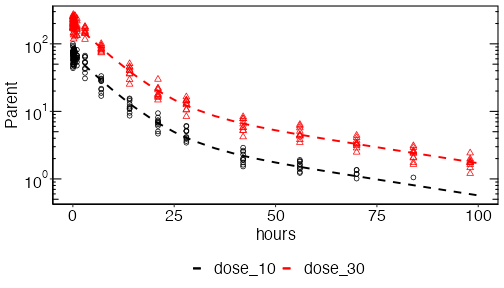

```{r setup, include=FALSE}
knitr::opts_chunk$set(echo = TRUE, message=FALSE, eval=FALSE)
require(ubiquity)
require(deSolve)
require(ggplot2)
require(foreach)
require(doParallel)
require(rhandsontable)
```

## Introduction
The workshop (https://workshop.ubiquity.tools) provides several examples of performing parameter estimation in ubiquity. To make a copy of these scripts and other supporting files in the current working directory run the following:

```{r eval=FALSE}
library(ubiquity)
fr = workshop_fetch(section="Estimation", overwrite=TRUE)
```

* ``analysis_parent.r`` - Least squares estimation of a single output
* ``analysis_parent_metabolite.r`` - Maximum likelihood estimation of two outputs
* ``analysis_parent_metabolite_global.r`` - Using global optimization packages   
* ``analysis_parent_metabolite_nm_data.r`` - Reading cohorts in from a NONMEM file
 
Each of these scripts build on the previous one to demonstrate different features of the ubiquity parameter estimation routines. All of these examples use a system (shown in the figure below) that contains three differential equations tracking the mass of the parent drug in the blood (``Mpb``) and in a tissue space (``Mpt``). In the blood the parent can form (``fmKp``) a metabolite (``Mmb``) with subsequent elimination (``Km``). The parent/metabolite model was adapted from the ADAPT5 Users Manual (https://bmsr.usc.edu/files/2013/02/ADAPT5-User-Guide.pdf). 

{width=100%}

Using ``system_new`` (use ``?system_new`` to see a list of the available system file examples) you can copy this template file into the current directory and build the system:

```{r results="hide", message=FALSE}
library(ubiquity)
system_new(file_name="system.txt", system_file="adapt", overwrite = TRUE)
cfg = build_system(system_file = "system.txt")
```

Once the system has been built, you can create a local copy of an estimation template for the system:

```{r results="hide", message=FALSE}
system_fetch_template(cfg, template="Estimation")
```

This should create the file: ``analysis_estimate.R`` in the working directory. At the beginning of the script there are three variables that are created to control what the script does and the format of the output. The variable ``analysis_name`` defines the prefix that will be prepended to the output generated by the script. Archiving the analysis results is controlled by the Boolean variable ``archive_results``. Lastly, the script is controlled using the ``flowctl`` variable (the possible options are listed and commented out).

The estimation script has the following main components:

1. Select the parameter set and subset of parameters to estimate
2. Set options (simulation, estimation, etc)
3. Load datasets
4. Define cohorts
5. Estimate parameters
6. Plot results

These will be explored using the scripts above.

##  Least squares estimation/single output (``analysis_parent.r``)

The first example above (``analysis_parent.r``) begins by specifying that we want to perform a parameter estimation and archive the results using the name[^1] ``parent_d1030`` to indicate we are analyzing the parent PK for the 10 and 30 mg dosing cohorts:

```{r results="hide", echo=TRUE, warning=FALSE}
flowctl = 'estimate'
archive_results = TRUE
analysis_name = 'parent_d1030'
```

Next we select the parameters to estimate. Because we're only estimating parent data, only the names of the parameters relevant to the parent PK (``pnames``) are selected. To estimate all parameters simply exclude the third argument. Because only system parameters are being estimated a weighted least squares objective will be used[^OBJ].

```{r results="hide", echo=TRUE}
pnames = c('Vp', 'Vt', 'CLp', 'Q')
cfg = system_select_set(cfg, "default", pnames)
```

Next we set options relevant to the estimation and the underlying simulation routines. In this example only the simulation output times have been specified, but any relevant parameters can be set. The template that is generated has several common options that are commented out. These can be uncommented  and modified as needed.

```{r results="hide", echo=TRUE}
cfg=system_set_option(cfg, group  = "simulation", 
                           option = "output_times", 
                           seq(0,100,1))
```

The dataset (shown in the table below) is included with the ``ubiquity`` package and is accessed here using ``system.file``. In the example script it is referenced explicitly. The format requirements of datasets is that they be flat files with a header row. The format is flexible and only requires time/observation information and columns required to filter the data and isolate cohorts that have received the same treatment. The inputs are defined when the cohorts themselves are defined. Data files are loaded using ``system_load_data`` and a name[^2] is assigned the dataset. Data can be read from files (csv, xls, and tab) or from an existing data frame. This name (``pm_data`` here) will be used to reference this dataset later in the script.

```{r results="hide", echo=TRUE, warning=FALSE}
cfg = system_load_data(cfg, dsname     = "pm_data", 
                            data_file  = system.file("ubinc", "csv",
                                                     "pm_data.csv", 
                                                     package = "ubiquity"))
```


```{r results="hide", echo=FALSE}
dataset = read.csv(system.file("ubinc", "csv", "pm_data.csv", package = "ubiquity"))
```
```{r echo=FALSE, fig.align="center"}
rhandsontable(dataset, width=400, height=200)
```

The dataset has a column for the observation time (``TIME``), the subject id (``ID``), concentrations for the parent (``PT``) and the metabolite (``MT``), a ``BLQ`` flag and the nominal dose (``DOSE``). But only some of these columns will be used (``TIME``, ``PT``, ``MT`` and ``DOSE``), and any others (``BQL``) will be ignored. This is intended to be an example and not a general guide for a dataset format. It is not necessary to have different outputs in different columns (wide format). The dataset could be loaded in the tall skinny format as well. In this example we are going to analyze the parent data for individuals given 10 or 30 mg using a least squares objective.

Next we need to identify the data and inputs associated with those data. This is done by defining *cohorts*, groups of data that receive the same treatment and the model inputs (bolus dosing, infusion rates, covariates) associated with those cohorts. In this example we will define a cohort for each dosing group. To make sure we are starting from a blank slate we can use ``system_clear_cohorts`` to remove any previously defined information.
```{r results="hide", echo=TRUE, warning=FALSE}
cfg = system_clear_cohorts(cfg)
```


For each cohort we define a list with information about that cohort. Each cohort should have a unique ``name`` field[^3] and a ``dataset`` field pointing to the dataset (``pm_data``) loaded above. The optional  cohort filter (``cf``) field is used to reduce the entire dataset to the records associated with this cohort. See the help for ``system_define_cohort`` for more information on how to construct cohort filters.

```{r results="hide", echo=TRUE, warning=FALSE}
cohort = list(
  name         = "dose_10",
  cf           = list(DOSE      = c(10)),
  inputs       = NULL,
  outputs      = NULL,
  dataset      = "pm_data")

```

Next it is necessary to define the inputs for this cohort. Here inputs refers to model inputs which may include both dosing as well as covariates, and the estimation template (generated using ``system_fetch_template`` above) should contain placeholders for each of these defined in the system file. Note: For bolus and infusion inputs, it is only necessary to define inputs that are nonzero, and for covariates it is only necessary to define those that differ from the definitions in the system file. For each input there is an ``AMT`` field and ``TIME`` field and the units here are those specified in the system file (both ``AMT`` and ``TIME`` are internal indentifiers and not taken from the dataset).

```{r results="hide", echo=TRUE, warning=FALSE}
cohort[["inputs"]][["bolus"]] = list()
cohort[["inputs"]][["bolus"]][["Mpb"]] = list(TIME=NULL, AMT=NULL)
cohort[["inputs"]][["bolus"]][["Mpb"]][["TIME"]] = c( 0) # hours 
cohort[["inputs"]][["bolus"]][["Mpb"]][["AMT"]]  = c(10) # mpk 

```

Next we need to match the outputs in the model to the outputs in the dataset. Under ``cohort$outputs`` there is a field used to group each output. Here the cohort **output mapping** for the blood PK of the parent output is ``Parent``. The times and observations in the dataset are found in the ``'TIME’`` column and the ``’PT’`` column (missing data specified by -1 will be dropped). These are mapped to the model timescale (``'hours'``, speified with ``<TS:?>``) and model output (``’Cpblood’``,  specified with ``<O>``). Note the units in the dataset must be the same as those in the model:

```{r results="hide", echo=TRUE, warning=FALSE}
cohort[["outputs"]][["Parent"]] = list()

# Mapping to data set
cohort[["outputs"]][["Parent"]][["obs"]] = list(
         time           = "TIME",
         value          = "PT",
         missing        = -1)

# Mapping to system file
cohort[["outputs"]][["Parent"]][["model"]] = list(
         time           = "hours",       
         value          = "Cpblood",   
         variance       = "1")

# Plot formatting
cohort[["outputs"]][["Parent"]][["options"]] = list(
         marker_color   = "black",
         marker_shape   = 1,
         marker_line    = 2 )
```

For each output grouping in the cohort the marker color, shape and line type can be specified (controlling the plotted output).

```{r results="hide", echo=TRUE, warning=FALSE}
cohort[["outputs"]][["Parent"]][["options"]] = list(
         marker_color   = "black",
         marker_shape   = 1,
         marker_line    = 2 )
```

Finally the cohort is defined using ``system_define_cohort``:

```{r results="hide", echo=TRUE, warning=FALSE}
cfg = system_define_cohort(cfg, cohort)
```

We do the same thing for the 30 mg dose group:

```{r results="hide", echo=TRUE, warning=FALSE}
cohort = list(
  name         = "dose_30",
  cf           = list(DOSE      = c(30)),
  dataset      = "pm_data",
  inputs       = NULL,
  outputs      = NULL)

# Bolus inputs for the cohort
cohort[["inputs"]][["bolus"]] = list()
cohort[["inputs"]][["bolus"]][["Mpb"]] = list(TIME=NULL, AMT=NULL)
cohort[["inputs"]][["bolus"]][["Mpb"]][["TIME"]] = c( 0) # hours 
cohort[["inputs"]][["bolus"]][["Mpb"]][["AMT"]]  = c(30) # mpk 


# Defining Parent output
cohort[["outputs"]][["Parent"]] = list()

# Mapping to data set
cohort[["outputs"]][["Parent"]][["obs"]] = list(
         time           = "TIME",
         value          = "PT",
         missing        = -1)

# Mapping to system file
cohort[["outputs"]][["Parent"]][["model"]] = list(
         time           = "hours",       
         value          = "Cpblood",   
         variance       = "1")

# Plot formatting
cohort[["outputs"]][["Parent"]][["options"]] = list(
         marker_color   = "red",
         marker_shape   = 2,
         marker_line    = 2 )
cfg = system_define_cohort(cfg, cohort)
```

After the cohorts have been defined we call the estimation function (``system_estimate_parameters``). If ``flowctl`` is set to  ``'plot previous estimate'`` or ``'plot guess'`` the those values will just be returned.

```{r echo=FALSE, message=FALSE, warning=FALSE, results="hide"}
cfg = system_set_option(cfg, group  = "estimation",
                             option = "control", 
                             value  = list(trace  = TRUE,
                                           maxit  = 10,
                                           REPORT = 10))
```

```{r echo=TRUE, message=FALSE, warning=FALSE, results="hide"}
pest = system_estimate_parameters(cfg, 
                                  flowctl         = flowctl, 
                                  analysis_name   = analysis_name, 
                                  archive_results = archive_results)
```

If one of the estimation options are selected for the ``flowctl`` then several files will be generated in the ``output`` folder with the ``analysis_name`` as a prefix:

* ``output/parent_d1030-report.txt`` - Text file with a summary of the estimation results. 
* `` output/parent_d1030-parameters_all.csv`` - Summary table with all parameters (estimated and fixed)
* `` output/parent_d1030-parameters_est.csv`` - Summary table with estimated parameters 
* `` output/parent_d1030-system_update.txt`` - Text to update the ``system.txt`` file with the new parameter estiamtes
* `` output/parent_d1030-sessionInfo.RData`` - The output of ``sessionInfo()`` is stored in the ``SI`` object in this data file

Next the system is simulated at the estimate and the data is stored in ``erp``. 
```{r results="hide", echo=TRUE, warning=FALSE}
cfg=system_set_option(cfg, group  = "simulation", 
                           option = "output_times", 
                           seq(0,100,5))
```

```{r results="hide", echo=TRUE, warning=FALSE}
erp = system_simulate_estimation_results(pest = pest, cfg = cfg) 

```

The information in this variable will be used to generate some standard plots below, but it may be desirable to save this information or generate your own figures. To do this it is necessary to understand the structure of ``erp``. This list has two different fields.

* ``erp$pred`` Data frame containing the time course data as well as the smooth predictions for all defined ``OUTPUTS`` for a given ``COHORT``. The column ``SMOOTH`` is used to indicate what record type we're dealing with. If the ``SMOOTH`` column is ``FALSE`` then ``OBS`` contains the observations and ``VAR`` contains the variance. If ``SMOOTH`` is ``TRUE`` then ``OBS`` and ``VAR`` will contain ``-1``. 
     + ``TIME`` - Time in units of the data
     + ``OBS`` - Observations (``SMOOTH = FALSE``), -1 (``SMOOTH=TRUE``)
     + ``PRED`` - Predictions (``SMOOTH = FALSE``)
     + ``VAR`` - Variance (``SMOOTH = FALSE``), -1 (``SMOOTH=TRUE``)
     + ``SMOOTH`` - ``FALSE`` for observation times, ``TRUE`` for observations
     + ``OUTPUT`` - name of the output
     + ``COHORT`` - name of the cohort
* ``erp$all`` List with model predictions for each output and state are generated for each cohort at the specified simulation times. 
     +  ``ts.time`` - Simulation time scale
     +  ``ts.TS`` - An entry for each timescale ``TS``
     +  ``pred`` - Simulated predictions
     +  ``name`` - State or model output
     +  ``cohort`` - Cohort name

Lastly the predictions overlaying the data and the observed vs predicted plots are generated using ``system_plot_cohorts``. Basic formatting of these figures is controlled using the ``plot_opts`` list (see the ``?system_plot_cohorts`` for details). 

```{r results="hide", echo=TRUE, warning=FALSE, fig.align="center", fig.width=2}
plot_opts = c()
plot_opts$outputs$Parent$yscale       = 'log'
```
 
```{r results="hide", echo=TRUE, warning=FALSE, message=FALSE}
plinfo = system_plot_cohorts(erp, plot_opts, cfg, analysis_name=analysis_name)
```

When called, ``system_plot_cohorts`` will write ``png`` and ``pdf`` output for the time course and observed vs predicted files. It will also return a list with the ``ggplot`` objects and relative paths to the files as well. In this example the following will be generated:

* output/parent_d1030_time course_Parent.pdf 
* output/parent_d1030_time course_Parent.png 
* output/parent_d1030_obs_pred_Parent.pdf 
* output/parent_d1030_obs_pred_Parent.png 

```{r echo=FALSE}
# Creating a reduced form of the estimation output to save it and use less disk space
estout = list()
estout$tc =  plinfo$timecourse$Parent
estout$op =  plinfo$obs_pred$Parent
ggsave(filename="Estimation-parent-tc.png", plot=estout$tc, height=4, width=7, units="in", dpi=72)
ggsave(filename="Estimation-parent-op.png", plot=estout$op, height=4, width=7, units="in", dpi=72)
```

{width=80%}

{width=80%}


### Automated Reporting

The outputs above provide components for generating presentations and other
documents. Coping and pasting these figures and tables into documents can be
tedious. It can be convenient to automate this process and this is
accomplished with the function ``system_report_estimation``. 


#### PowerPoint

To append the results of an analysis to a PowerPoint document simply
initialize a new report (``rpttype="PowerPoint"``), call
``system_report_estiamtion`` with the appropriate  ``analysis_name``, and the
results of the analysis will be attached as slides. 

```{r results="hide", echo=TRUE, eval=FALSE}
cfg = system_report_init(cfg, rpttype="PowerPoint")
cfg = system_report_estimation(cfg=cfg, analysis_name=analysis_name)
system_report_save(cfg=cfg, output_file=file.path("output",paste(analysis_name, "-report.pptx", sep="")))
```

This will then save the analysis results to the ``output`` directory.

#### Word

The process for a Word document is the same. Just make sure that the
``rpttype`` is set to ``"Word"`` when the report is initialized:

```{r results="hide", echo=TRUE, eval=FALSE}
cfg = system_report_init(cfg, rpttype="Word")
cfg = system_report_estimation(cfg=cfg, analysis_name=analysis_name)
system_report_save(cfg=cfg, output_file=file.path("output",paste(analysis_name, "-report.docx", sep="")))
```

For more information on integrated report generation see the ``Reporting`` vignette. 

## Maximum likelihood/two outputs (``analysis_parent_metabolite.r``)

This example is similar to the last except we are analyzing two different outputs (parent and metabolite) and we have a proportional variance model. So now we can estimate the parameters associated with those outputs as well as the variance parameters:

```{r results="hide", echo=TRUE, eval=FALSE}
pnames = c('Vp',
           'Vt',
           'Vm',
           'CLp',
           'Q',
           'CLm',
           'slope_parent',
           'slope_metabolite');

cfg = system_select_set(cfg, "default", pnames)
```


The parameters being estimated contain variance parameters (``slope_parent`` and ``slope_metabolite``) so a maximum likelihood objective will be used. The cohort definitions look much the same as those before except the variance model here is defined as  ``'slope_parent*PRED^2'``, and there is a separate output named ``Metabolite``.
```{r results="hide", echo=TRUE, eval=FALSE}
cohort = list(
  name         = "dose_10",
  cf           = list(DOSE      = c(10)),
  inputs       = NULL,
  outputs      = NULL,
  dataset      = "pm_data")


# Bolus inputs for the cohort
cohort[["inputs"]][["bolus"]] = list()
cohort[["inputs"]][["bolus"]][["Mpb"]] = list(TIME=NULL, AMT=NULL)
cohort[["inputs"]][["bolus"]][["Mpb"]][["TIME"]] = c( 0) # hours 
cohort[["inputs"]][["bolus"]][["Mpb"]][["AMT"]]  = c(10) # mpk 


# Defining Parent output
cohort[["outputs"]][["Parent"]] = list()

# Mapping to data set
cohort[["outputs"]][["Parent"]][["obs"]] = list(
         time           = "TIME",
         value          = "PT",
         missing        = -1)

# Mapping to system file
cohort[["outputs"]][["Parent"]][["model"]] = list(
         time           = "hours",       
         value          = "Cpblood",   
         variance       = "slope_parent*PRED^2")

# Plot formatting
cohort[["outputs"]][["Parent"]][["options"]] = list(
         marker_color   = "black",
         marker_shape   = 1,
         marker_line    = 1 )

# Defining Metabolite output
cohort[["outputs"]][["Metabolite"]] = list()

# Mapping to data set
cohort[["outputs"]][["Metabolite"]][["obs"]] = list(
         time           = "TIME",
         value          = "MT",
         missing        = -1)

# Mapping to system file
cohort[["outputs"]][["Metabolite"]][["model"]] = list(
         time           = "hours",       
         value          = "Cmblood",   
         variance       = "slope_metabolite*PRED^2")

# Plot formatting
cohort[["outputs"]][["Metabolite"]][["options"]] = list(
         marker_color   = "blue",
         marker_shape   = 1,
         marker_line    = 1 )

cfg = system_define_cohort(cfg, cohort)
```

Similar modifications were made to the 30 mg dosing cohort.

## Global estimation routines (``analysis_parent_metabolite_global.r``)

Now we build on the previous example to demonstrate how to select different optimization routines. By default, the parameter estimation is carried out using the ``Nelder-Mead`` optimization method from the ``optim`` library. You can specify different functions in the library. See the documentation for optim (?optim) for valid values for method and elements for the control.  For example, to use simulated annealing change the ``method`` to ``SANN``. 

```{r eval=FALSE}
cfg = system_set_option(cfg, group  = "estimation",
                             option = "method",
                             value  = "SANN")
```

There are also global optimization libraries in R, and two of these can be readily used with ubiquity: Particle Swarm Optimizer (``pso`` package) and Genetic Algorithms (``GA`` package).


To use the ``pso`` package set the following options:
```{r eval=FALSE}
library("pso")
cfg = system_set_option(cfg, group  = "estimation",
                             option = "optimizer", 
                             value  = "pso")

cfg = system_set_option(cfg, group  = "estimation",
                             option = "method",
                             value  = "psoptim")
```

To use the ``GA`` package set the following options:
```{r eval=FALSE}
library(GA)

cfg = system_set_option(cfg, group  = "estimation",
                             option = "optimizer", 
                             value  = "ga")

cfg = system_set_option(cfg, group  = "estimation",
                             option = "method",
                             value  = "ga")

cfg = system_set_option(cfg, group  = "estimation",
                             option = "control", 
                             value  = list(maxiter   = 10000, 
                                           optimArgs = list(method  = "Nelder-Mead",
                                                            maxiter = 1000)))
```

**Note:** Optimizers like ``SANN`` and the global optimizers (``pso`` and ``GA``) are good for identifying parameter sets outside of the region of the initial guess. However, one consequence of these algorithms is they can quickly approach the bounds. Consequently it is important to provide realistic upper and lower bounds on the parameters (the ``<P>`` descriptor in the system file or using ``system_set_guess`` at the scripting level). If you use the default value of machine precision (``eps``) for the lower bound and infinity (``Inf``) for the upper bound these optimization routines can choose parameter values that can cause the internal simulations to fail.

## Cohorts from NONMEM dataset (``analysis_parent_metabolite_nm_data.r``)

In the examples above, cohorts are defined manually. Sometimes you may have data in a NONMEM dataset where the dosing information is located in the dataset. It may be convenient to simply define a cohort for each subject in the dataset. To do that the function ``system_define_cohorts_nm`` can be used. The differences between the script ``analysis_parent_metabolite.r`` will now be highlighted:

First we load the NONMEM dataset and clear the cohorts:
```{r eval=FALSE}
cfg = system_load_data(cfg, dsname     = "nm_pm_data", 
                            data_file  = system.file("ubinc", "csv",
                                                     "nm_data.csv", 
                                                     package = "ubiquity"))
cfg = system_clear_cohorts(cfg);
```


 


Next we define a filter to use on the dataset (include only the 10 and 30 mg doses):
```{r eval=FALSE}
filter = list()
filter$DOSE = c(10, 30)
```
For more information on filtering datasets see the help for ``nm_select_records``.

Now we define maps for the different outputs. For each output we specify the variance, compartment (``CMT``) number, model output and the missing number flag:

```{r eval=FALSE}
OBSMAP = list()
OBSMAP$PT = list(variance     = 'slope_parent*PRED^2',
                 CMT          =  1,
                 output       = 'Cpblood', 
                 missing      =  -1 )

OBSMAP$MT = list(variance     = 'slope_metabolite*PRED^2',
                 CMT          =  2,
                 output       = 'Cmblood', 
                 missing      =  -1 )
```

Lastly we define a map for the model inputs. In this case we only have a bolus in the ``Mpb`` compartment:
```{r eval=FALSE}
INPUTMAP = list()
INPUTMAP$bolus$Mpb$CMT_NUM             =  1
```

Unused columns in the dataset will be ignored. With the filter, input and observation maps defined, we now add the cohorts
```{r eval=FALSE}
cfg = system_define_cohorts_nm(cfg, 
                               DS       = 'nm_pm_data',
                               col_ID   = 'ID',   col_CMT  = 'CMT', col_DV   = 'DV',
                               col_TIME = 'TIME', col_AMT  = 'AMT', col_RATE = 'RATE',
                               col_EVID = 'EVID', col_GROUP= 'DOSE',
                               filter   =  filter, 
                               INPUTS   =  INPUTMAP,
                               OBS      =  OBSMAP,
                               group    =  FALSE)
```
                                

## Contents of ``system.txt``
```{r echo=FALSE, comment='', message=TRUE, eval=TRUE}
cat(readLines(system.file("ubinc", "systems","system-adapt.txt", package="ubiquity")), sep="\n")
```
 
[^1]: analysis names must start with a letter and containing only letters, numbers, and _
[^2]: dataset names must start with a letter and containing only letters, numbers, and _
[^3]: cohort names must start with a letter and containing only letters, numbers, and _
[^OBJ]: The objective function is set based on the parameters being estimated. If there are no variance parameters being estimated a weighted least squares objective will be used. If there are variance parameters being estimated then a maximum likelihood objective will be used. 
