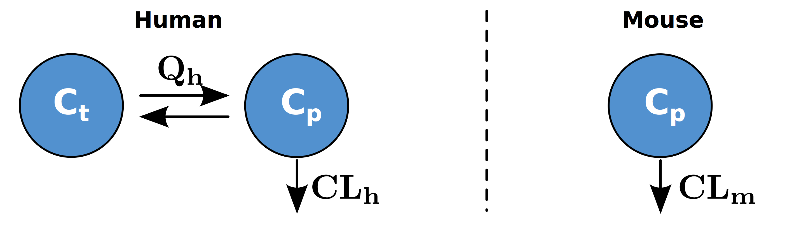
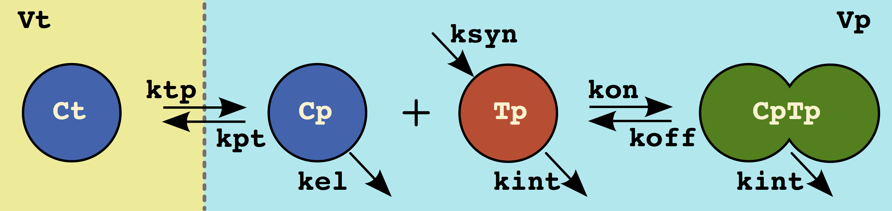
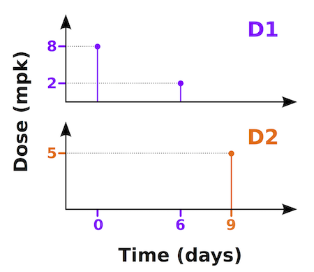
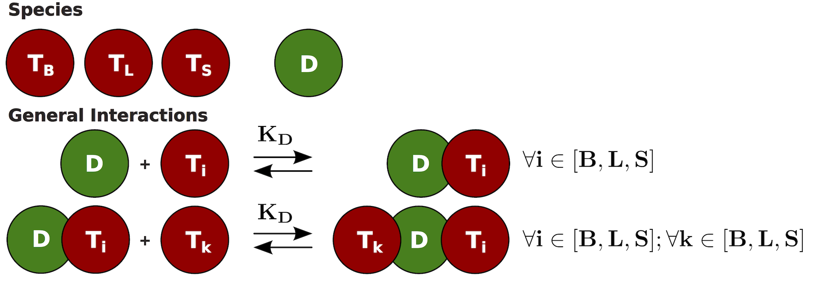

```{r setup, include = FALSE}
# knitr::opts_chunk$set(
#   collapse = TRUE,
#   comment = "#>"
# )
knitr::opts_chunk$set(echo = TRUE)
```

## Introduction 

At its core, ubiquity is a modeling language and a set of scripts meant to facilitate model development and deployment. The focus of this document is on the model description language. This is a plain text file, referred to as a **system file**. Each line contains a descriptor (e.g. ``<P>``) which defines an aspect of the model, and comments are made with the hash sign (``#``). What follows is an overview of the different components of the language that can be used to create a system file.


## Parameters 
### System parameters ``<P>``

Each system parameter is specified with a name, value, lower bound, upper bound, units, whether it should be editable in the ShinyApp and the 'type' of parameter (grouping in the ShinyApp). The values of eps (machine precision, smallest value that is not zero) and inf (infinity) can be used. For example to specify a parameter koffR with a value of .1 that is positive and a parameter KDR with a value of .04 that is also positive the following would be used:

~~~
#   name  value    lb     ub   units  editable type
<P> koffR 0.1      eps    inf   1/hr  yes      Target
<P> KDR   0.04     eps    inf   nM    yes      Target
~~~

### Parameter sets

Often a model will be developed to incorporate different situations or scenarios. For example, a model may be used to describe both healthy and diseased individuals. When these differences are simply parametric in nature, it can be cumbersome to code a model multiple times (once for each parameterization). This framework provides a mechanism for including multiple parameterizations withing the same system file. Consider the system below where we want to describe antibody disposition. For humans this is described by a two compartment model, but for mice a single compartment is needed.


{width=60%}

First we create a set of parameters describing the human scenario.
These are the mean parameters taken from the literature [DM]:

~~~
<P> Weight   70.0    eps inf kg   yes   System # Organism weight
<P> CL        0.0129 eps inf L/hr yes   System # Systemic Clearance
<P> Q         0.0329 eps inf L/hr yes   System # Inter-compartmental clearance
<P> Vp        3.1    eps inf L    yes   System # Vol. central compartment
<P> Vt        2.8    eps inf L    yes   System # Vol. peripheral compartment
~~~

When a parameter is created using the ``<P>`` descriptor it is part of
the ``default`` parameter set. This is the short name[^1] for a
parameter set. A longer more verbose name can be given as well,
and this is what will be seen in the ShinyApp. The human parameter set
can be labeled using the ``PSET`` descriptor in the following way:

~~~
<PSET:default> mAb in Human
~~~

Where ``default`` is the parameter set short name name, and “mAb in Human” is the value shown to the user in the ShinyApp.

Next, to add the parameterization for mice we simply create a new set in the following way:

~~~
<PSET:mouse> mAb in Mouse
~~~

This alone would create a new parameter set with a short name ``mouse``, and is an exact copy of the default parameter set. To identify the parametric differences between the ``mouse`` and ``human`` we use ``PSET`` in the following way: 

~~~
<PSET:mouse:Weight > 0.020 # 20 gram mouse
<PSET:mouse:CL >     7.71e-6
<PSET:mouse:Q>       0.0
<PSET:mouse:Vp >     1.6e-3
<PSET:mouse:Vt >     1   # arbitrary
~~~

Consider the clearance parameter entry where we want the murine half-life of an antibody [VR]:

~~~
<PSET:mouse:CL> 7.71e-6
~~~

We use the set name (``mouse``) and the parameter name (``CL``) and then we overwrite the default with the specified value ``7.71e-6``. The other aspects of the parameter (bounds, edit flag, etc.) will be the same as the default value. 


### Secondary parameters ``<As>`` and ``<Ad>``

A static secondary parameter refers to parameter does not change during a simulation.  These are specified using the ``<As>`` descriptor and can be written in terms of system parameters or previously defined static secondary parameters. These can be used in differential equations, defining initial conditions, input scaling and model outputs. This is similar to secondary parameters defined in the ``$PK`` block in NONMEM. For example, if you wanted to define the rate of elimination in terms of the system parameters for clearance ``CL`` and volume of distribution ``Vp`` the following would be used:

~~~
<As> kel = CL/Vp
~~~
 
A dynamic secondary parameters refers to a parameter that can change during a simulation. This typically means it is defined, using the ``<Ad>`` descriptor, in terms of a state or another dynamic secondary parameter. These can be used in differential equations and model outputs. These are similar to the parameters defined in the ``$DES`` block in NONMEM. For example if you wanted to use the concentration in the central compartment ``Cp`` but it was dependent on the amount in that compartment ``Ap`` and the volume of that compartment ``Vp`` the following would be used:

~~~
<Ad> Cp = Ap/Vp
~~~


### Variance parameters ``<VP>``

Variance parameters are specified using the same format as system parameters (``<P>``) :

~~~
#    name    value lower_bound upper_bound units editable grouping
<VP > SLOPE  0.01  eps         inf         1/hr   yes     Variance
~~~

The difference being that the ``<VP>`` descriptor is used and that the grouping is set to ``Variance``. These are used when performing parameter estimation and when simulating with residual variability.

### Variability: defining the variance/covariance Matrix ``<IIV:?>?`` \& ``<IIVCOR:?>?``

Any variable name assigned to inter-individual variability (IIV) or correlation/covariance (IIVCOR) term that makes sense to the user may be used. The following sample codes have variable names (eg: ETACL) that most likely make sense to a population modeler or NONMEM user. To define an IIV term named ``ETACL`` with a variance of ``0.15`` use the following:

~~~
<IIV:ETACL> 0.15
~~~

The next we need to associate this IIV term with a system parameter. To associate this IIV term with the clearance (system parameter ``CL``) and specify that it has a log normal distribution (``LN``) we would simply write:

~~~
<IIV:ETACL:LN> CL
~~~

Alternatively a normal (``N``) distribution can be used.

Next we specify the IIV term ``ETAV`` with a variance of ``0.1``. This IIV term also has a log normal distribution and is applied to the parameter ``V``:

~~~
<IIV:ETAV> 0.10
<IIV:ETAV:LN> V
~~~

Now we can define the covariance (off-diagonal elements) between ``CL`` and ``V`` to be ``0.01`` by using:

~~~
<IIVCOR:ETAV:ETACL> 0.01
~~~

The order isn’t important and the IIV terms can be reversed

### IIV and parameter sets ``<IIVSET:?>?`` \& ``<IIVCORSET:?>?``

By default all parameter sets will have inter individual variability specified using the ``<IIV>`` and ``<IIVCOR>`` descriptors. To associate a specific set of IIVs to a parameter set use the ``<IIVSET>`` and ``<IIVCORSET>`` descriptors. These set descriptors operate differently than the parameter set descriptors (``<PSET>``). The ``<PSET>`` just overwrites the default values and inherits the default variance/covariance information. If you alter the IIV information for a parameter set it will *reset* the IIV information for that parameter set. The entire variance covariance matrix will need to be specified for that parameter set. 

If the parameter set ``MYPSET`` has been defined then the following could be used to define the IIV for the parameters ``Q`` and ``CL``:

~~~
<IIVSET:MYPSET:ETAQ>           0.05
<IIVSET:MYPSET:ETAQ:LN>        Q

<IIVSET:MYPSET:ETACL>          0.25
<IIVSET:MYPSET:ETACL:LN>       CL

<IIVCORSET:MYPSET:ETAQ:ETACL>  0.01
~~~

All the other system parameters will have no IIV information for this parameter set.


## Differential equations

The differential equations in the system can be defined by simply writing them out. Alternative they can 'built' by using the different descriptors provided below. Part of the flexibility of ubiquity lies in the ability to combine these different notations. To construct a model (see section below: Bringing it all together) any combination of the five following methods can be used:

1. Differential equations        ``<ODE:?>``
2. Reaction rates                ``=?=>``
3. Equilibrium relationships     ``<=kforward:kreverse=>``
4. Sources and sinks             ``<S:?>``
5. Movement between compartments ``<C>``

### Writing ODEs ``<ODE:?>``

Portions of differential equations can be specified here where ? is the state or compartment. To define ``dA/dT`` as ``koffR*C - konR*A*B``  we would write:

~~~
<ODE:A> koffR*C - konR*A*B 
~~~

It might be more convenient to specify an ODE across several lines, making things more readable. Just use multiple statements and they will be appended together. This would give the same result as the example above:

~~~
<ODE:A>    koffR*C
<ODE:A>  - konR*A*B 
~~~

### Rate equations ``=?=>``

It may be more convenient to write out chemical reactions rather than differential equations. This can be done using the general form:

~~~
[CR1]Reactant1 + [CR2]Reactant2 + ... =kf=> [CP1]Product1 + [CP2]Product2 + ...
~~~

Where the stoichiometric coefficients, beginning with ``CR`` and ``CP`` above, in brackets only need to be specified if they are not one. The reaction order will be assumed to be equal to the stoichiometric coefficient of the reactant. For a more specific example Consider decomposition of hydrogen peroxide into water and oxygen:


$$ H_2O_2 \xrightarrow{k_{deg}} H_2O + \frac{1}{2}O_2 $$

In the system format this would be written in the following manner:

~~~
H2O2 =kdeg=> H2O + [0.5]O2
~~~


And this will be translated in to the following differential equations:

$$
\frac{dH_2O_2}{dt}=-k_{deg}H_2O_2 \\
\frac{dH_2O}{dt}= k_{deg}H_2O_2 \\
\frac{dO_2}{dt}= 0.5k_{deg}H_2O_2
$$

Which could also be defined as differential equations using the `<ODE:?>?`. This is the equivalent:

~~~
<ODE:H2O2>   - kdeg*H2O2 
<ODE:H2O>      kdeg*H2O2 
<ODE:O2>   0.5*kdeg*H2O2 
~~~


The rates (e.g. ``kdeg``) need to be defined as either a system or secondary parameter. This is where you can put saturable terms, such as Michaelis-Menten kinetics.

### Equilibrium relationships ``<=kforward:kreverse=>``

Forward and reverse reaction rates can be written separately:

~~~
A + B =konR=>   C       
C     =koffR=>  A + B
~~~

Or these can be written as equilibrium equations with the forward (`konR`) and reverse (`koffR`) rates specified as:

~~~
A + B  <=konR:koffR=>  C       
~~~

To specify this reaction as differential equations, the following could have also been used:

~~~
<ODE:A>  koffR*C - konR*A*B
<ODE:B>  koffR*C - konR*A*B
<ODE:C> -koffR*C + konR*A*B
~~~

The stoichiometric coefficients also define the reaction order here. For example, to create the following equilibrium reaction:

$$ 2A + 3B \mathop{\rightleftarrows}^{\mathrm{k_f}}_{\mathrm{k_r}}  4C $$

This rate notation could be used in the system file:

~~~
[2]A + [3]B  <=kf:kr=>  [4]C       
~~~

Which will produce the following in terms of differential equations:

$$
\frac{dA}{dt} = 2k_rC^4 - 2k_fA^2B^3 \\
\frac{dB}{dt} = 3k_rC^4 - 3k_fA^2B^3 \\
\frac{dC}{dt} =-4k_rC^4 + 4k_fA^2B^3
$$
To write this equilibrium reaction as differential equations the following would be used:

~~~
<ODE:A>   =  2*kr*SIMINT_POWER[C][4] - 2*kf*SIMINT_POWER[A][2]*SIMINT_POWER[B][3]
<ODE:B>   =  3*kr*SIMINT_POWER[C][4] - 3*kf*SIMINT_POWER[A][2]*SIMINT_POWER[B][3]
<ODE:C>   = -4*kr*SIMINT_POWER[C][4] + 4*kf*SIMINT_POWER[A][2]*SIMINT_POWER[B][3]
~~~

See below about generic functions such as `SIMINT_POWER[][]`.

### Sources and sinks  ``<S:?>``
This method allows turnover to be described in terms of synthesis and degradation terms.
If ``A`` is produced at a rate of ``ksynA`` (mass quantities), degraded at a
rate of ``kdegA``, and modeled in concentration units then the
sources are specified on the left hand side of ``<S:?>`` and the sinks
(elimination) are specified on the left hand side of ``<S:?>``. Multiple
sources and sinks can be separated by semicolons. In this example with a
compartment volume ``V``

~~~
ksynA/V <S:A> kdeg*A
~~~

Which is the same as writing out the differential equation:

~~~
<ODE:A> koffR*C - konR*A*B + ksynA/V - kdeg*A
~~~

### Movement between compartments ``<C>``

When mass moves between two physical spaces with different volumes we need to specify, for each compartment, the species, volume and rate of transport.  The ``<C>`` descriptor allows us to just identify the compartment information separated by semicolons (order is important)

~~~
Species; Volume; Rate <C> Species; Volume; Rate
~~~

For movement between a central compartment ``A`` with a volume ``V`` to the tissue space ``At`` with a volume ``Vt`` at rates ``kps`` and ``ksp`` respectively this is specified in the following manner:

~~~
A; V; kps <C> At; Vt; ksp
~~~

Which is the equivalent of the following differential equation:

~~~
<ODE:A>   -kps*A + ksp*At*Vt/V
<ODE:At>  +kps*A*V/Vt - ksp*At
~~~

## Bringing it all together

{width=60%}

As a final example consider the target-mediated drug disposition system above. This system can be defined with a set of ODES:

~~~
<ODE:Ct>  Cp*kpt*Vp/Vt - Ct*ktp
<ODE:Cp> -Cp*kpt       + Ct*ktp*Vt/Vp -  kel*Cp   + koff*CpTp - kon*Cp*Tp
<ODE:Tp>               + ksyn/Vp      - kint*Tp   + koff*CpTp - kon*Cp*Tp
<ODE:CpTp>                            - kint*CpTp - koff*CpTp + kon*Cp*Tp
~~~

Or it could simply be defined in terms of the underlying processes:

~~~
# tissue distribution
Ct; Vt; ktp <C> Cp; Vp; kpt

# equilibrium
Cp + Tp <=kon:koff=> CpTp

# Turnover
 ksyn/Vp <S:Tp>   kint*Tp
         <S:Cp>    kel*Cp
         <S:CpTp> kint*CpTp
~~~


### Initial conditions ``<I>``


By default all initial conditions are zero. You can specify a non-zero initial condition using the ``<I>`` string to set a 'state' to a 'value'

~~~
<I> state = value
~~~

Value can be any combination of numbers, system parameters ``<P>`` or static secondary parameters ``<As``.  Consider a turnover system where the value of ``ksyn`` and ``kdeg`` are specified  as parameters:

~~~
<P> ksyn  0.1      eps    inf   1/hr  yes      Target
<P> kdeg  0.04     eps    inf   nM    yes      Target
~~~

We can calculate the initial value for a target as:

~~~
<As> T_IC = ksyn/kdeg
~~~

Then we can specify the initial value of the target as:

~~~
<I> T = T_IC
~~~

## Model inputs

Inputs into the model include typical interventions such as bolus dosing or continuous infusions. However inputs here refers to mathematical inputs. Typically covariates may be attributes of the system (such as gender, or a specific genotype), but are treated here as inputs. When defining inputs it is necessary to provide typical/placeholder values. These provide default values for both the ShinyApp interface as well as the scripting level (Matlab and R) where they can be overwritten by the user. 


### Bolus dosing ``<B:times>``, ``<B:events>``

The ``<B:?>`` descriptor is used to define bolus dosing.  Dosing information
is broken down into a list of ``times`` when bolus injections occur and a list
of ``events`` containing the amount the specified  compartment will receive.

Each of these has a ``scale`` that is used to convert the bolus dosing information from proscribed units (mg daily) into the units in which the system is coded (nM and hours). So if dosing is done on days 0, 1, 2... but the simulation time is hours, then the scale for the dosing times is 24.

The events contain the magnitude of the bolus at a given time. If you have multiple compartments receiving a bolus, the times must include all times in which a bolus may be applied to the system. If a state does not receive a bolus on a particular time, its magnitude at that time is 0.


To illustrate this consider the following dosing schedule:

{width=50%}


In this example we want to dose two different drugs into two different states/compartments.  Drug 1 (<span style="color:purple">**D1**</span>) will be dosed into ``Cp1`` and drug 2 (<span style="color:orange">**D2**</span>) into ``Cp2``. Dosing will be in mg/kg but concentrations are in mg/ml. The dosing time is in days, but the simulation time units are hours. We will be dosing <span style="color:purple">**D1**</span> at <span style="color:purple">**8**</span> \& <span style="color:purple">**2**</span> mpk on days <span style="color:purple">**0**</span> & <span style="color:purple">**6**</span>. <span style="color:orange">**D2**</span> will be dosed at <span style="color:orange">**5**</span> mpk on day <span style="color:orange">**9**</span>.  

~~~
#  type       state     values     scale  units   
<B:times>;            [0 6 9];       24;  days   
<B:events>;    Cp1;   [8 2 0];    70/V1;  mpk   
<B:events>;    Cp2;   [0 0 5];    70/V2;  mpk   
~~~

Assume ``V1`` and ``V2`` are the compartmental volumes for <span style="color:purple">**D1**</span> and <span style="color:orange">**D2**</span>  in ml, and the subject body weight is 70 kg. This would convert those doses in mpk into mg/ml. Again these are the default doses that can be overwritten both in the ShinyApp and within scripts. 

### Continuous infusions ``<R:?>``
Rates of infusion are defined using the ``<R:?>`` descriptor. Like bolus values, infusion rates have two components. There is a component that specifies switching times (e.g. switching from 10 mg/hr to 0). And each switching time has a corresponding rate of infusion. This infusion rate will be held constant until the next time. Also like the bolus specification there is a **scale** associated with both infusion ``times`` and the ``levels`` that converts the proscriptive units into the units of the simulation. Consider the following example: 

~~~
# name      time/levels values    scale  units
<R:myrate>; times;      [0 30];   1/60;    min
<R:myrate>; levels;     [1 0];    60;   mg/min
~~~

These two entries create the infusion rate called ``myrate``. This can be used in any of your system specifications (e.g., ``<ODE:Cp> myrate/Vp``). The first row specifies the times when the rate is changed (``0`` and ``30`` minutes). If the system is coded in terms of hours, then the scale of ``1/60`` must be used. The levels indicate a rate of ``1`` mg/min that is switched off at ``30`` minutes. This has to be converted to mg/hr using the scale of ``60``. You can add as many paired rate entries as you need to describe as many infusion interventions as necessary. 

### Covariates  ``<CV:?>``, ``<CVSET:?:?>``

### Simple covariates 

For simulation purposes covariates (normally found in a dataset) need to be defined. Covariates can be either constant or change with time. The times values *must be the same scale as the system*. The following defines the value for the covariate ``RACE``:

~~~
<CV:RACE>; times;  [0];     hours
<CV:RACE>; values; [1];     ethnicity
~~~

Covariates can also change with time. In this case consider the subject weight (``WGT``). It begins at ``70`` and measurements are made at several time points.  

~~~
<CV:WGT>; times;  [ 0 1680 3360 5040 10080];     hours 
<CV:WGT>; values; [70   65   60   58    56];     kg     
~~~

Next we can alter how the simulations will interpret these values by setting the type of covariate. By default the weight will be linearly interpolated (``type = linear``), however we can hold the weight constant until the next measurement is encountered (last value carried forward) by declaring the type as ``step``

~~~
<CVTYPE:WGT> step
~~~

Now if the model was parameterized for male and female subjects we can define two parameter sets (as described above) to account for this:

~~~
<PSET:default>  Male   
<PSET:female>   Female          
~~~

And the values for the covariate can be changed for the set 'female':

~~~
<CVSET:female:WGT>; times;   [ 0 1680 3360 10080]
<CVSET:female:WGT>; values;  [60   55   52    50]
~~~

### Complicated covariates

Detailed time course profiles can be created as well. For example, to create a covariate profile that is zero from time 0-1 and at time 1 it jumps to 8 and decreases at a rate of 1 per unit time until time 5 where it stays at the value 4 until time 12. It might have a profile like the following:                                                         

{width=50%}

~~~
# name        time/values  values                         units
<CV:mycov>  ; times;       [0 .999 1 5 12];  hours
<CV:mycov>  ; values;      [0 0    8 4 4 ];  --   
<CVTYPE:mycov> linear
~~~

## Model outputs

Outputs are defined here in terms of states, parameters, secondary parameters, input rates, and covariates listed above. The format used is:

~~~
<O> name = expression
~~~

For example:

~~~
<O> A_obs = A
<O> Coverage = A/(KD + A)
<O> QC_CLtot = Cp*CL/Vp + Cp*Vmax/(Km+Cp)
~~~

Outputs that begin with ``QC``, like ``QC_CLtot`` above, will not be displayed in the ShinyApp. This is intended to make them available at the scripting level for quality control (QC) purposes.

## Functions and operators

Most of the standard operators behave as expected (``+``, ``-``, ``*``, & ``/``) because most languages use these consistently. There are however certain operators and functions that differ between languages. For example, consider the power function ($a^b$). In FORTRAN this would be ``a**b``, in Matlab it is ``a^b``, and in C it is ``pow(a,b)``. Given the objectives here (write once and create multiple formats), this can be quite challenging. The solution used here is to convert language specific functions and operators into generic functions. So the power operator would be:

~~~
SIMINT_POWER[a][b]
~~~

This would then be converted to the appropriate output format depending on the output target. The following generic functions can be used:

Operator/Function      | Example   |  Format
-----------------------|-----------|-----------------------
power                  | $a^b$     | ``SIMINT_POWER[a][b]``
exponential            | $e^a$     | ``SIMINT_EXP[a]``
log base 10            | $\log(a)$ | ``SIMINT_LOG10[a]``
log base e             | $\ln(a)$  | ``SIMINT_LOGN[a]``
less than              | $a < b$   | ``SIMINT_LT[a][b]``
less than or equal     | $a \le b$ | ``SIMINT_LE[a][b]``
greater than           | $a > b$   | ``SIMINT_GT[a][b]``
greater than or equal  | $a \ge b$ | ``SIMINT_GE[a][b]``
equal                  | $a == b$  | ``SIMINT_EQ[a][b]``
and                    | $a \& b$  | ``SIMINT_AND[a][b]``


### Current simulation time
For some systems you will want to access the simulation time. To do this you can use the internal variable  ``SIMINT_TIME``.

### Modeling quasi-equilibrium of target-mediated drugs
The free amount of a drug ``Cfree`` which is binding to a receptor with an affinity of ``KD`` given total values ``Ctot`` and ``Rtot`` the following can be calculated using the following equation: 

$$
C_{free}=\frac{1}{2}
\left[
(C_{tot}-R_{tot}-K_D)
+ \sqrt{(C_{tot}-R_{tot}-K_D)^2 + 4K_DC_{tot}}
\right]
$$

This can be tedious, especially using the generic functions above. To make this easier you can use the following generic function:

~~~
<Ad> Cfree = SIMINT_QEQ[Ctot][Rtot][KD]
~~~

To get ``Rfree``, just switch the first two arguments:

~~~
<Ad> Rfree = SIMINT_QEQ[Rtot][Ctot][KD]
~~~

## Timescales

Each system has default units in which it is constructed, and should be indicated in the comments of the model. It can be useful (for generating figures for example) to show simulations in different time scales. Now this can be achieved by multiplying the time outputs by the correct scaling factor. However this requires the end user to (1) remember the original timescale and (2) correctly scale that value.

Now while this is not particularly challenging from a mathematical perspective, it introduces a chance for error. It is possible, instead, to specify time scale information using the ``<TS:?>`` descriptor. If the system is coded in hours, the following will define timescales for the default (hours), days, weeks and months:

~~~
<TS:hours>  1.0
<TS:days>   1.0/24.0
<TS:weeks>  1.0/24.0/7.0
<TS:months> 1.0/24.0/7.0/4.0
~~~

These are used both in the **ShinyApp** and at the command line in **Matlab** and **R**

## Mathematical sets

Consider the following systems:

**PBPK:** Most of the organs in these systems are mathematically identical, with only variations in the parameters. However coding each of these organs or modifying an existing system (say to incorporate the presences of a target in each organ) can become tedious.

**Anti-drug antibody generation:** If we consider ADAs generated in response to therapeutic proteins, the response will consist of a distribution of ADAs in terms of their concentration and a separate distribution in terms of their affinity. Modeling this maturation process and the interactions between the ADAs, the therapeutic protein, and drug targets becomes unmanageable quickly.

The question is: How can we make difficult problems easy and intractable problems possible? The solution implemented here allows the system to be defined in terms of **mathematical sets** 


### Set notation ``<SET:?>?``

Consider the interactions occurring in an assay designed to detect drug (``D``) present in serum. In this assay a biotinylated target (``TB``) is used to pull down the drug and a labeled target (``TL``) is the signaling molecule used. The assay will provide a signal when a complex containing both ``TB`` and ``TL`` are present (``TB:D:TL`` or ``TL:D:TB``). Samples can contain soluble target as well (``TS``) which can interfere with the assay. To model this assay, the following interactions should be considered:

{width=80%}

Several options are available to construct this system. The ODEs could simply be typed out for every possible combination. It’s also possible to use the equilibrium ``<=kon:koff=>`` for all the interactions as well. However, there is another option that will handle the enumeration more easily. First we define the two mathematical sets ``TSi`` and ``TSk``:

~~~
<SET:TSi> TL; TB; TS
<SET:TSk> TL; TB; TS
~~~

With these defined we can then use the
curly brace notation (``{ }``) with any of the
descriptors used to construct a system.
For example, the initial conditions for each of the target states are
defined as parameters (``T0_TL``, ``T0_TS``, ``T0_TB``) in the model. These have
to be identified as initial conditions using the ``<I>`` notation, and can be
done with a single statement. This line:

~~~
<I> {TSi} = T0_{TSi} 
~~~

Expands to:

~~~
<I> TL = T0_TL
<I> TB = T0_TB
<I> TS = T0_TS
~~~

Similar to the initial condition, the equilibrium between the monomeric drug and the different targets can be defined using a single statement:

~~~
D + {TSi} <=kon:koff=> D_{TSi}
~~~

That uses only one of the sets (``TSi``) and will be expanded for each element in that set. To account for the formation of complexes that contain a drug molecule and two different target molecules, the following statement is used:

~~~
D_{TSi} + {TSk} <=kon:koff=> {TSk}_D_{TSi}
~~~

This statement contains two different sets (``TSi`` and ``TSk``). When multiple sets are encountered, every possible combination is evaluated

#### Aligning Sets

By default sets will interpreted by evaluating every possible permutation as shown above. However, it may be desirable to pair or align sets. Take for example the transit compartments implemented by Lobo and Balthasar to delay the onset of drug effect on cancer cells [LB]. The transit compartment are implemented using a series of differential equations:

$$
  \frac{dK1}{dt} = (K-K1)\frac{1}{\tau} \\
  \frac{dK2}{dt} = (K1-K2)\frac{1}{\tau} \\
  \frac{dK3}{dt} = (K2-K3)\frac{1}{\tau} \\
  \frac{dK4}{dt} = (K3-K4)\frac{1}{\tau} 
$$

It's possible to code each of these individually, but it's also possible to define these using mathematical set notation. We see that in the first equation K is paired or aligned with K1, and in the second it's K1 and K2, etc. So first we define two sets of equal length whose elements are aligned:

```
<SET:TRIN>    K; K1; K2; K3
<SET:TROUT>  K1; K2; K3; K4 
```
Next we write the ``<ODE:?>?`` statement in terms of these sets, but we use the ``SIMINT_SET_ALIGN`` function:

```
SIMINT_SET_ALIGN[TRIN;TROUT][<ODE:{TROUT}> 1.0/tau*({TRIN}-{TROUT})]
```

The first argument is the names of sets to align separated by a semicolon ``;`` and the second argument is the system file descriptor written in terms of these sets. This will be expanded internally into:

```
<ODE:K1> 1.0/tau*(K-K1)
<ODE:K2> 1.0/tau*(K1-K2)
<ODE:K3> 1.0/tau*(K2-K3)
<ODE:K4> 1.0/tau*(K3-K4)
```

#### Set Functions 

It can be useful to perform operations over sets. To do this you can use the following functions:

* ``SIMINT_SET_SUM`` is the mathematical equivalent of $\sum_{SET}$
* ``SIMINT_SET_PRODUCT`` is the mathematical equivalent of $\prod_{SET}$

These functions take two bracketed arguments. The first argument is the set name and the second argument is the mathematical relationship to be expanded. For example, consider a system that has been parameterized for several species. The variable ``EN_Mouse`` is 1 if the species is mouse and 0 otherwise. Similarly for ``EN_Human``, ``EN_Monkey``, etc. We have also defined the body weights as system parameters: ``BW_Mouse`` for the mouse, ``BW_Human`` for human, etc. Now we want to assign ``BW`` to the value of the currently selected species (where ``EN`` for that species is 1). First we would define the species parameter set:

```
<SET:SP> Mouse; Rat; Monkey; Human
```
Next we would define the secondary parameter ``BW`` by summing the product of the Boolean species parameter and the body weight for that species:

```
<As> BW = SIMINT_SET_SUM[SP][EN_{SP}*BW_{SP}]
```


#### Set Evaluation

Sets are evaluated in the following order:

* First set functions (``SIMINT_SET_SUM`` and ``SIMINT_SET_PRODUCT``) are evaluated.
* Next aligned sets are applied (``SIMINT_SET_ALIGN``)
* Lastly, remaining sets are evaluated for every permutation 

## Piecewise-continuous functions/parameters ``<IF:?:?>``

To specify a conditional assignment use the statement:

~~~
<IF:name:COND> boolean; value
~~~

Here ``name`` is the name of the secondary parameter be defined and ``COND`` indicates
that we have a Boolean condition that needs to be satisfied. The condition
(``boolean``) can be and, or, greater than, etc. relationships. 
The parameter will be assigned to have the value when this Boolean relationship is true. These conditions can be a function of different elements of the system depending on whether or not name refers to a static or dynamic secondary parameter:

* ``<As>`` function of system parameters, previously defined static secondary parameters and covariates that do not change for a given subject.
* ``<Ad> `` function of system parameters, static secondary parameters, states, previously defined dynamic secondary parameters and covariates.

It is important to include a default ``ELSE`` condition:

~~~
<IF:name:ELSE> value
~~~

### Constructing a piece-wise continuous function/parameter

To see an example use the following command (use `?system_new` to see a list of the available system file examples):

`system_new(system_file="pwc", file_name="system-pwc.txt")`

In this example we specify fast (``kelf``) and slow (``kels``) rates of elimination. We want to have the fast rate be active when the drug concentration is above ``Cth`` and the time is below ``Tf``. The system parameters would look like:

~~~
<P> kelf   1.0  eps inf   1/time   yes System
<P> kels   0.01 eps inf   1/time   yes System
<P> Cth   10    eps inf   conc     yes System
<P> Tf    10    eps inf   time     yes System
~~~

Now we need to define the rate of elimination such that the constraints above are followed. First we define ``kel`` as a dynamic secondary parameter with a value of 0.0. Then we define the different conditions and relevant values:

~~~
<Ad > kel = 0.0
<IF:kel:COND> SIMINT_AND[SIMINT_LT[SIMINT_TIME][Tf]][ SIMINT_GT[Cp][Cth]]; kelf
<IF:kel:ELSE> kels
~~~

## Controlling indices 

By default, the build script will construct odes, parameter sets, etc. automatically. This means that the order of states/compartments are going to be arbitrary. Sometimes it is necessary to specify the order of your states or outputs. For example when using NONMEM the order in the control stream must correlate with the values in the dataset. To specify that a state ``Cp`` should be compartment ``3``, the following should be used:

~~~
<INDEX:STATE:Cp>  3
~~~

The general notation for an output or state ``name`` assigned to a ``number`` is:

~~~
<INDEX:STATE:name>  number
<INDEX:OUTPUT:name> number
~~~

## Concentrations vs amounts
It's more convenient to model systems in terms of concentrations. However some software does not allow scaling of inputs. And when inputs are provided in mass units, you need your differential equation to also be in mass units. You can use the `<AMTIFY>` descriptor in your 
`system.txt` to tell ubiquity to generate perform this conversion on the differential equations.

For example, if you defined the state `Cc` but want it to be `Ac` within the NONMEM model target. These are related by `Cc = Ac/Vc` and `Vc` is a parameter the following would be used:

~~~
<AMTIFY> Cc; Ac; Vc
~~~

## Options

Several options can be specified using the ``<OPT:?`` delimiter. If you've defined the ``days`` timescale using ``<TS:?>?`` this can be used as the timescale for plotting in the ShinyApp by using:

~~~
<OPT:TS>  days
~~~

To define the default output times for the ShinyApp and simulation scripts use the following:

~~~
<OPT:output_times> SIMINT_SEQ[0][100][1]
~~~

## Example system files

These example system files can be found in the examples directory of the stand-alone analysis template ([ubiquity_template.zip](https://ubiquity-pkpd.s3-us-west-1.amazonaws.com/files/ubiquity_analysis_development.zip)). Most can also be loaded form the R package (see the help for `?system_new`).


* ``system-adapt.txt`` - Parent/metabolite structural model taken from the ADAPT5 Users Manual [ADAPT]. This system is used in the estimation examples of the ubiquity workshop.
* ``system-glp_study.txt`` - PK model parameterized for humans and NHPs, used as an example for GLP tox study design.
* ``system-mab_pk.txt`` - Linear model of mAb PK for humans taken from [DM]. This model is used in the simulation examples of the ubiquity workshop.
* ``system-one_cmt_cl.txt``  - One compartment model parameterized in terms of clearances and volumes.
* ``system-one_cmt_micro.txt`` - One compartment model parameterized for micro constants (rates).
* ``system-pbpk.txt`` - Implementation of large molecule PBPK model by Shah and Betts [SB]. This model provides good examples of how to use mathematical set notation.
* ``system-pbpk_template.txt`` - Template containing the species parameter from [SB]. This can be used to construct systems parameterized for multiple species. 
* ``system-pwc.txt`` - Example of how to construct piece-wise secondary parameters (i.e. using if/then/else statements).
* ``system-sets.txt`` - Example of how to parameterized systems with multiple parameter sets.
* ``system-tmdd.txt`` - Example of how to code a TMDD model using either ODEs or process descriptors. 
* ``system-tumor.txt`` - Implementation of transit effect model in cancer cell inhibition from [LB]. This demonstrates how to use aligned mathematical sets. 
* ``system-two_cmt_cl.txt`` - Two compartment model parameterized in terms of clearances and volumes
* ``system-two_cmt_micro.txt`` - Two compartment model parameterized in terms of micro constants (rates)

## Templates

When the system is built, multiple files are generated in the temporary directory (`transient`) to support different software. In the R package you can access these and other templates programatically (see the help for `?system_fetch_template`). This is a list of the supporting software and what is generated. 

### R workflow 

* `auto_simulation_driver.R`: R-Script with named with placeholders used to run simulations.
* `auto_analysis_estimation.R`: R-Script with named with placeholders used to perform naive-pooled parameter estimation.

### Matlab workflow 

* `auto_simulation_driver.m`: M-file with named with placeholders used to run simulations.
* `auto_analysis_estimation.m`: M-file with named with placeholders used to perform naive-pooled parameter estimation.

### Other Software Targets

* `target_adapt_5.for` and `target_adapt_5-PSET.prm`: The system defined for Adapt Fortran and a parameter (`prm`) file for each parameter set `PSET`.

* `target_berkely_madonna-PSET.txt`: This is a text file containing the system for the parameter set `PSET` to run in Berkeley Madonna.

* `target_mrgsolve-PSET.cpp`: This is a C++ file containing the system for the parameter set `PSET` to run using the in `mrgsolve` package in R.

* `target_monolix-PSET.txt`: This is a text file containing the system for the parameter set `PSET` to run in Monolix. 

* `target_nlmixr-PSET.R`: This R script defines the system for analysis in `nlmixr` for the parameter set `PSET`.

* `target_nonmem-PSET.ctl`: This is a NONMEM control stream containing the system for the parameter set `PSET`.

## References

* [ADAPT] [Adapt 5 Users Guide](https://bmsr.usc.edu/files/2013/02/ADAPT5-User-Guide.pdf)
* [DM] [Dirks & Meibohm Clin. PK (2010) Oct 1;49(10):633-59](https://doi.org/10.2165/11535960-000000000-00000)
* [LB] [Lobo, E.D. & Balthasar, J.P. AAPS J (2002) 4, 212-222](https://doi.org/10.1208/ps040442)
* [MK] [Mager, D.E. & Krzyzanski, W. Pharm Res (2005) 22: 1589.](https://doi.org/10.1007/s11095-005-6650-0)
* [SB] [Shah, D.K. & Betts, A.M. JPKPD (2012) 39 (1), 67-86](https://doi.org/10.1007/s10928-011-9232-2)
* [VR] [Vieira & Rajewsky Eur J Immunol. (1988) Feb;18(2):313-6](https://doi.org/10.1002/eji.1830180221) 


[^1]: parameter set short names must start with a letter and containing only letters, numbers, and _