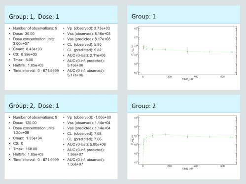

```{r setup, include=FALSE}
knitr::opts_chunk$set(echo = TRUE, message=FALSE, eval=FALSE)
require(ubiquity)
require(ggplot2)
require(rhandsontable)
require(gridExtra)
# The presim variable will contain presimualted data when eval is set to true
presim_loaded = FALSE
```

```{r echo=FALSE, results=FALSE}
  presim= list()
  if(file.exists("NCA_presim.RData")){
    file.remove("NCA_presim.RData")
  }
```

```{r echo=FALSE, results=FALSE, eval=TRUE}
if(file.exists("NCA_presim.RData")){
  load("NCA_presim.RData")
  presim_loaded = TRUE
}
```

## Introduction

Non-compartmental analysis (NCA) is a simple and quick method for evaluating the exposure of a drug. It allows you to evaluate things like linearity and in vivo exposure. To illustrate this consider an antibody given in a subcutaneous injection. The actual profile a patient might experience is given in the solid black line. But we don't yet have the ability to sample in a continuous fashion. What we might observer is given by the blue points.   

```{r warning=FALSE, message=FALSE, echo=FALSE, error=FALSE, results="hide", fig.width=8, fig.height=4}
system_new(system_file="mab_pk", overwrite=TRUE)
cfg = build_system()
parameters = system_fetch_parameters(cfg)
cfg = system_zero_inputs(cfg)
cfg = system_set_bolus(cfg, state   ="At", 
                            times   = c(  0.0),  #  day
                            values  = c(400.0))  #  mg

cfg=system_set_option(cfg, group  = "simulation",
                           option = "output_times",
                           linspace(0,30,100))

som_smooth = run_simulation_ubiquity(parameters, cfg) 
som_smooth$simout$time_C_ng_ml = som_smooth$simout$C_ng_ml*som_smooth$simout$ts.days

cfg=system_set_option(cfg, group  = "simulation", 
                            option = "include_important_output_times", 
                            value  = "no")

cfg=system_set_option(cfg, group  = "simulation",
                           option = "output_times",
                           c(0,.25, .5, 1, 2,7,14,21,28))
som_sample = run_simulation_ubiquity(parameters, cfg) 
som_sample$simout$time_C_ng_ml = som_sample$simout$C_ng_ml*som_sample$simout$ts.days


polydf = NULL
for(tidx in 1:(nrow(som_sample$simout)-1)){
  xv = c(som_sample$simout$ts.days[tidx], som_sample$simout$ts.days[tidx+1],  som_sample$simout$ts.days[tidx+1], som_sample$simout$ts.days[tidx] )  
  yvC = c(som_sample$simout$C_ng_ml[tidx], som_sample$simout$C_ng_ml[tidx+1], 0, 0)  
  yvTC = c(som_sample$simout$time_C_ng_ml[tidx], som_sample$simout$time_C_ng_ml[tidx+1], 0, 0)  
  tmpdf = data.frame(xv = xv, yvC=yvC, yvTC=yvTC, sp=tidx)
  if(is.null(polydf)){
    polydf = tmpdf 
  } else {
    polydf = rbind(tmpdf, polydf)
  }
}
```

```{r results="hide", warning=FALSE, echo=FALSE}
# When eval is set to TRUE we save the presimulated results
  presim$plots$som_smooth = som_smooth
  presim$plots$som_sample = som_sample
  presim$plots$polydf     = polydf
```

```{r results="hide", warning=FALSE, echo=FALSE, eval=TRUE}
if(presim_loaded){
  som_smooth = presim$plots$som_smooth 
  som_sample = presim$plots$som_sample 
  polydf     = presim$plots$polydf
}
```

```{r warning=FALSE, message=FALSE, echo=FALSE, error=FALSE, eval=TRUE, results="hide", fig.width=8, fig.height=4}
p_C = ggplot()
p_C = p_C +  geom_line(data=som_smooth$simout, aes(x=ts.days, y=C_ng_ml))
p_C = p_C + geom_point(data=som_sample$simout, aes(x=ts.days, y=C_ng_ml), color="blue")
p_C = p_C + xlab("Time") + ylab("Concentration") + ggtitle("AUC")
p_C = p_C +  geom_polygon(data=polydf, aes(x=xv, y=yvC, group=sp), color="blue", linetype='dashed', fill="lightblue")
p_C = p_C + theme(plot.title = element_text(hjust = 0.5))
p_C = prepare_figure(fo=p_C, purpose="shiny")


p_TC = ggplot()
p_TC = p_TC +  geom_line(data=som_smooth$simout, aes(x=ts.days, y=time_C_ng_ml))
p_TC = p_TC + geom_point(data=som_sample$simout, aes(x=ts.days, y=time_C_ng_ml), color="blue")
p_TC = p_TC + xlab("Time") + ylab("Time x Concentration") + ggtitle("AUMC")
p_TC = p_TC +  geom_polygon(data=polydf, aes(x=xv, y=yvTC, group=sp), color="blue", linetype='dashed', fill="lightblue")
p_TC = p_TC + theme(plot.title = element_text(hjust = 0.5))
p_TC = prepare_figure(fo=p_TC, purpose="shiny")


p_AUC = p_C
p_AUMC = p_TC
```

```{r warning=FALSE, message=FALSE, echo=FALSE, error=FALSE, eval=TRUE, fig.width=8, fig.height=3.5}
gridExtra::grid.arrange(p_AUC, p_AUMC, ncol=2)
```

Generally NCA will determine the following directly from the data:

* ``Cmax`` - Maximum observed concentration (units=concentration)
* ``Tmax`` - The time where the maximum concentration was observed (units=time)
* ``AUC`` - The area under the curve  ($units=time \times concentration$)
* ``AUMC`` - The area under the first moment curve  ($units=time^2 \times concentration$)

These properties are all based on observational data. So the ``Cmax`` and ``Tmax`` will most certainly not be at the actual maximum concentration but as long as we sample judiciously it will give us a good approximation. Similarly, the calculated ``AUC`` and ``AUMC`` will be different than the actual values. To calculate the areas you need to dig back into your calculus text books to the trapezoid method. Basically each sampling interval is a trapezoid and the area of each is calculated and added up for all of the ``n`` samples:

$$
AUC = \int_0^{t_f} Cdt \approx  \sum_{i=1}^{n-1}{\frac{C_i+C_{i+1}}{2}\times (t_{i+1}-t_{i})},  \ \ \ \ \ 
AUMC = \int_0^{t_f} t\times Cdt \approx  \sum_{i=1}^{n-1}{\frac{t_iC_i+t_{i+1}C_{i+1}}{2}\times (t_{i+1}-t_{i})}
$$

This can be done in Excel pretty easily. Depending on the data and the analysis other properties can be calculated. For example we can calculate the clearance, steady-state volume of distribution and terminal half-life:

* Clearance: $CL = \frac{Dose}{AUC}$
* Mean residence time: $MRT = \frac{AUMC}{AUC}$
* Steady state volume of distribution: $V_{ss} = MRT \times CL$
* Half-life: Terminal slope of the natural log of the data

Properties like AUC and AUMC can also be be calculated using extrapolation from the last time point to infinity to account for data beyond the observations at hand. The subsequent values of clearance, volumes of distribution, etc can also change with extrapolation. 

There is a lot of nuance associated with these calculations, and it is good to rely on software that focuses on this type of analysis. The [``PKNCA``](https://github.com/billdenney/pknca) package has been developed with this in mind. Ubiquity provides a set of functions to automate NCA and reporting for preclinical data. These functions act as a wrapper for the ``PKNCA`` package which does most of the heavy lifting. Only a small subset of the ``PKNCA`` functionaltiy is used here. If more extensive analysis is necessary then ``PKNCA`` can be used directly. 

This vignette contains a series of examples on how to perform NCA in ubiquity. To make a copy of these scripts and other supporting files in the current working directory run the following:

```{r warning=FALSE, message=FALSE, echo=TRUE, error=FALSE, results="hide", fig.width=8, fig.height=4}
library(ubiquity)
fr = workshop_fetch(section="NCA", overwrite=TRUE)
```

This creates several files in the working directory. First are data sets:

* ``pk_all_sd.csv`` PK data for multiple subjects dosed either IV or SC at different levels
* ``pk_all_md.csv`` Multiple dose data with intensive sampling on the first and last dose
* ``pk_sparse_sd.csv`` Single dose data with sparse sampling

Next the following scripts demonstrate how to perform NCA:

* ``analysis_nca_sd.R``     Single dose data for individuals
* ``analysis_nca_md.R``     Multiple dose data for individuals
* ``analysis_nca_sparse.R`` Average NCA when analyzing sparsely sampled data

## Quick Template for Running NCA

You should read the rest of the vigette below to understand the required data format and how the functions work. But if you are returning to this and you just want a template for running NCA you can use the following:

```{r warning=FALSE, message=FALSE, echo=TRUE,  error=FALSE, results="hide", fig.width=8, fig.height=4}
library(ubiquity)
cfg = build_system()
fr = system_fetch_template(cfg, template = "NCA")
```

This will create the file ``analysis_nca.R`` in the current working directory. You can just uncomment/edit that script to get started.


## Single Dose Data
This example follows the script ``analysis_nca_sd.R``, and uses the dataset ``pk_all_sd.csv``. 

### Expected Format of Data
First we build the system and load the dataset.

```{r warning=FALSE, message=FALSE, echo=TRUE,  error=FALSE, results="hide", fig.width=8, fig.height=4}
cfg = build_system(system_file="system.txt")
cfg = system_load_data(cfg, dsname     = "PKDATA", 
                            data_file  = "pk_all_sd.csv")
```

The NCA functions in ubiquity expect data to have a certain format. There are columns that are required, those that are optional or depend on the kind of analysis being performed and other columns can also be present. In this context consider the following dataset: 

```{r echo=FALSE, fig.align="center", eval=TRUE}
rhandsontable(read.csv(system.file("ubinc", "csv", "pk_all_sd.csv" , package="ubiquity")), width=500, height=200)
```

The required columns and their names in this dataset provided in parenthesis are:

* ``ID``   Unique subject identifier (``ID``)
* ``TIME``  Time since the first dose (``TIME_HR``)
* ``NTIME`` Time since the last dose (since we are dealing with single dose data this is also ``TIME_HR``)
* ``CONC``  Observed concentration for this record (``C_ng_ml`` in ng/ml)
* ``DOSE`` Dose given (``DOSE`` in mg)
* ``ROUTE`` Route of administration (``ROUTE``); can be either: ``iv bolus``, ``iv infusion`` or ``extra-vascular``

Optional columns include:

* ``DOSENUM`` When analyzing multiple dose data (example below), this column will be used to associate records with doses
* ``BACKEXTRAP`` Back-extrapolation of IV data can be done generally for the entire dataset or this column can be used to specify the number of points to use on an individual basis
* ``SPARSEGROUP`` Grouping for sparse sampling data where you want to average data at each time point

### NCA and Outputs

Next we perform the NCA using ``system_nca_run``:

```{r warning=FALSE, message=FALSE, echo=TRUE, error=FALSE, results="hide", fig.width=8, fig.height=4}
cfg = system_nca_run(cfg, dsname        = "PKDATA", 
                           dscale        = 1e6, 
                           analysis_name = "pk_single_dose", 
                           extrap_C0     = FALSE, 
                           dsmap         = list(TIME    = "TIME_HR", 
                                                NTIME   = "TIME_HR", 
                                                CONC    = "C_ng_ml", 
                                                DOSE    = "DOSE",
                                                ROUTE   = "ROUTE", 
                                                ID      = "ID"),
                           digits        = 3)
```

We link the analysis to the dataset by specfying the dataset name (``dsname``) used when we load the dataset. The dosing in the dataset is in mg (i.e. 30 mg dose), but the mass units of the concentration values are in ng (i.e. ng/ml). The ``dscale`` input converts the mass units in the dose to the mass units in the observed concentration. The ``analysis_name`` [^1] is used both to refer to this analysis in the reporting function as well as in the files generated by the analysis. By default the initial concentration (nominal time zero) will be back-extrapolated but can be disabled by  setting ``extrap_C0`` to FALSE. Next we map the columns in the dataset to names used by the analysis (``dsmap``). Note that both the actual time (``TIME``) and nominal time (``NTIME``) both use the same column in the dataset (``TIME_HR``). Lastly, the ``digits`` input will define rounding rules for the reported values. 


Running this function will produce the following files:

* ``output/pk_single_dose-nca_summary-pknca.csv``  Summary level output from the analysis (see table below)
* ``output/pk_single_dose-nca_data.RData``         R objects used for downstream reporting
* ``output/pk_single_dose-pknca_raw.csv``          Raw output from PKNCA


```{r warning=FALSE, message=FALSE, echo=FALSE, error=FALSE}
nca_summary = read.csv(file.path("output", "pk_single_dose-nca_summary-pknca.csv"))
presim$sd$nca_summary = nca_summary
```

```{r results="hide", warning=FALSE, echo=FALSE, eval=TRUE}
if(presim_loaded){
  nca_summary = presim$sd$nca_summary
}
```

```{r echo=FALSE, fig.align="center", eval=TRUE}
rhandsontable(nca_summary,  width=500, height=200)
```

The following columns are provided in the outputd, and when calculated with ``PKNCA`` output names provided in perenthesis are those from ``PKNCA``:

* ``ID`` Subject ID for when ``sparse = FALSE`` and group ID when ``sparse = TRUE``
* ``Nobs`` Number of observations used for calculation
* ``Dose_Number`` Current dose number
* ``Dose`` Dose (units from the dataset)
* ``Dose_CU`` Dose (mass in units from concentration data)
* ``Cmax`` Maximum observed concentration 
* ``Tmax`` Time of Cmax
* ``halflife`` Terminal half-life (``half.life``)
* ``Vp_obs`` When the dosing route is "iv bolus", this is the volume calculated by dividing the dose in concentration units by the first observed concentration or C0 of extrapolation is selected. For other routes a value of -1 will be returned.
* ``Vss_obs`` Steady-state volume of distribution based on observation data (``vss.obs``)
* ``Vss_pred`` Steady-state volume of distribution with $C_{last,pred}$ as the final observation
  (``vss.pred``)
* ``C0`` Back-extrapolated initial concentration
* ``CL_obs`` Clearance  based on observation data (``cl.obs``)
* ``CL_pred`` Clearance calculated using  $C_{last,pred}$ as the final observation (``cl.pred``)
* ``AUClast`` Area under the curve  based on observation data (``auclast``)
* ``AUCinf_obs`` Area under the curve extrapolated to infinity using observed data (``aucinf.obs``)
* ``AUCinf_pred`` Area under the curve extrapolated to infinity using $C_{last,pred}$ as the final observation (``aucinf.pred``)

Where $C_{last,pred}$ is the predicted concentration at the final sample time by regression of the terminal phase of data. 

### Automated Reporting

#### PowerPoint

Once the NCA has been run, the results can be appended to an open PowerPoint report. Here we initialize an empty report then use the function ``system_report_nca`` and the analysis name assigned to the analysis above (``pk_single_dose``) to attach those results. Then we can write the file:

```{r warning=FALSE, message=FALSE, eval=FALSE, echo=TRUE, error=FALSE, results="hide", fig.width=8, fig.height=4}
cfg = system_report_init(cfg, rpttype="PowerPoint")
cfg = system_report_slide_title(cfg, title = "NCA of Single Dose PK")
cfg = system_report_nca(cfg, analysis_name = "pk_single_dose")
system_report_save(cfg, output_file=file.path("output", "pk_single_dose-report.pptx"))
```

For each dose a summary slide will be produced and a full timecourse will be created showing all of the data for that subject/group in the dataset:


* Actual data in grey
* Data used for NCA in green
* Initial extrapolated concentrations in orange (solid)
* Points used for extapolating "iv bolus" data are shown in orange open circles

Below shows the slides generated for an individual subject and the first set of summary slides for the analysis. Notice that because ``extrap_C0`` was set to ``FALSE`` C0 was not calculated (-1). Because this individual received a SC dose the estimate for ``Vp`` is also not calcualted (-1). Also note that the data for this inidivudal did not allow for extrapolation of AUC to infinity (``NA``). As a result the parameters that depend this value also resulted in (``NA``). The timecourse figure shows the data in the dataset (grey closed symbols, solid line) and the data used for NCA (green open symbols, dashed line). This way you can visually confirm at the subject level what data was used. 

{width=80%} 


#### Word

Similarly, a Word report can be generated by appendign the report to an already initialzed Word report. This is done by setting the ``rpttype`` to ``"Word"`` when calling ``system_report_init``. This will attach the same content to the report as with PowerPoint report above.

```{r warning=FALSE, message=FALSE, eval=FALSE, echo=TRUE, error=FALSE, results="hide", fig.width=8, fig.height=4}
cfg = system_report_init(cfg, rpttype="Word")
cfg = system_report_nca(cfg, analysis_name = "pk_single_dose")
system_report_save(cfg=cfg, output_file=file.path("output", "pk_single_dose-report.docx"))
```

For more information on integrated report generation see the ``Reporting`` vignette. 

## Multiple Dose Data
This example follows the script ``analysis_nca_md.R``, and uses the dataset ``pk_all_md.csv``.   If we rebuild the system and load the multiple dose dataset we can see that the dataset looks almost identical to the single dose data set. The primary difference is that there are two extra columns: ``NTIME_HR`` and ``EXTRAP``. The first column (``NTIME_HR``) contains the time since the last dose. The ``EXTRAP`` column is optional and allows the user to specify the number of points to back extrapolate C0 for ``iv bolus`` dosing. This will have no effect unless it is specified in the ``dsmap`` below. If you scroll through the data you can see that there is intensive sampling for ``DOSENUM`` 1 and 6. But for doses 2-5 there are only three samples per interval. These latter dose intervals (2-5) will be ignored with the default value of ``NCA_min`` (4) which defines the minimum number of saples required for analysis.
```{r warning=FALSE, message=FALSE, echo=TRUE, error=FALSE, results="hide", fig.width=8, fig.height=4}
cfg = build_system(system_file="system.txt")
cfg = system_load_data(cfg, dsname     = "PKDATA", 
                            data_file  = "pk_all_md.csv")
```

```{r echo=FALSE, fig.align="center", eval=TRUE}
rhandsontable(read.csv(system.file("ubinc", "csv", "pk_all_md.csv" , package="ubiquity")), width=500, height=200)
```

Next we perform the NCA and reporting as before. The only difference here is that we've removed the ``extrap_C0`` option. The default value is ``TRUE`` so back-extrapolation will occur. For IV dosing this is log-linear extrapolation to a nominal time of zero. For SC dosing this will be 0 for the first dose and the last observation from the last dosing interval for subsequent dosing. 
```{r warning=FALSE, message=FALSE, echo=FALSE, error=FALSE, results="hide", fig.width=8, fig.height=4}
cfg = system_nca_run(cfg, dsname        = "PKDATA", 
                          dscale        = 1e6, 
                          analysis_name = "pk_multiple_dose", 
                          dsmap         = list(TIME    = "TIME_HR", 
                                               NTIME   = "NTIME_HR", 
                                               CONC    = "C_ng_ml", 
                                               DOSE    = "DOSE",
                                               ROUTE   = "ROUTE", 
                                               ID      = "ID",
                                               DOSENUM = "DOSENUM",
                                               EXTRAP  = "EXTRAP"),
                          digits        = 3)
```

```{r warning=FALSE, eval=FALSE, message=FALSE, echo=TRUE, error=FALSE, results="hide", fig.width=8, fig.height=4}
cfg = system_nca_run(cfg, dsname        = "PKDATA", 
                          dscale        = 1e6, 
                          analysis_name = "pk_multiple_dose", 
                          dsmap         = list(TIME    = "TIME_HR", 
                                               NTIME   = "NTIME_HR", 
                                               CONC    = "C_ng_ml", 
                                               DOSE    = "DOSE",
                                               ROUTE   = "ROUTE", 
                                               ID      = "ID",
                                               DOSENUM = "DOSENUM",
                                               EXTRAP  = "EXTRAP"),
                          digits        = 3)
cfg = system_report_init(cfg)
cfg = system_report_slide_title(cfg, title = "NCA of Multiple Dose PK")
cfg = system_report_nca(cfg, analysis_name = "pk_multiple_dose")
system_report_save(cfg, output_file=file.path("output", "pk_multiple_dose-report.pptx"))
```

The same files are generated with the ``pk_multiple_dose`` prefix in the out ``output`` folder. The summary can be seen here:

```{r warning=FALSE, message=FALSE, echo=FALSE, error=FALSE}
nca_summary = read.csv(file.path("output", "pk_multiple_dose-nca_summary-pknca.csv"))
presim$md$nca_summary = nca_summary
```

```{r results="hide", warning=FALSE, echo=FALSE, eval=TRUE}
if(presim_loaded){
  nca_summary = presim$md$nca_summary
}
```

```{r echo=FALSE, fig.align="center", eval=TRUE}
rhandsontable(nca_summary,  width=500, height=200)
```


Below you can see the report slides for two subjects. The first subject was dosed IV. Again the grey markers/solid line show the full timecourse for that subject from the dataset. The data used for NCA (dose 1 and 6) is shown in green. The solid orange marker shows the extrapolated C0. If you look closely the open orange markers show the data points used for extraplation conneced with an orange dashed line. The second subject was given SC doses. For the first dose the extraplated C0 was zero. This can be seen by the green dashed line extendeding down to zero. The C0 for dose 6 is simply the last observation carried forward as shown by the solid orange marker. 

{width=80%} 

## Sparse Sampling

This example follows the script ``analysis_nca_sparse.R``, and uses the dataset ``pk_all_sparse.csv``. First we rebuild the system and load the sparsely sampled dataset. This data is very similar to the single dose dataset above except each ID only has three samples. 

```{r warning=FALSE, message=FALSE, echo=TRUE, error=FALSE, results="hide", fig.width=8, fig.height=4}
cfg = build_system(system_file="system.txt")
cfg = system_load_data(cfg, dsname     = "PKDATA", 
                            data_file  = "pk_sparse_sd.csv")
```

```{r echo=FALSE, fig.align="center", eval=TRUE}
rhandsontable(read.csv(system.file("ubinc", "csv", "pk_sparse_sd.csv" , package="ubiquity")), width=500, height=200)
```

When we run the NCA we need to tell the function that we want to perform a sparse analysis. This is done by setting the ``sparse`` input to ``TRUE``. We also need to provide information on how to group cohorts. This is done by providing a ``SPARSEGROUP`` option in the ``dsmap``. In this case we can just use the ``DOSE`` column, however a different column could have been used. 

```{r warning=FALSE, message=FALSE, echo=FALSE, error=FALSE, results="hide", fig.width=8, fig.height=4}
cfg = system_nca_run(cfg, dsname        = "PKDATA", 
                          dscale        = 1e6, 
                          analysis_name = "pk_sparse",
                          sparse        = TRUE,
                          dsmap         = list(TIME        = "TIME_HR", 
                                               NTIME       = "TIME_HR", 
                                               CONC        = "C_ng_ml", 
                                               DOSE        = "DOSE",
                                               ROUTE       = "ROUTE", 
                                               ID          = "ID",
                                               SPARSEGROUP = "DOSE"),
                          digits        = 3)
            

cfg = system_report_init(cfg)
cfg = system_report_slide_title(cfg, title = "NCA of Sparsely Sampled PK")
```
```{r warning=FALSE, message=FALSE, eval=FALSE, echo=TRUE, error=FALSE, results="hide", fig.width=8, fig.height=4}
cfg = system_nca_run(cfg, dsname        = "PKDATA", 
                          dscale        = 1e6, 
                          analysis_name = "pk_sparse",
                          sparse        = TRUE,
                          dsmap         = list(TIME        = "TIME_HR", 
                                               NTIME       = "TIME_HR", 
                                               CONC        = "C_ng_ml", 
                                               DOSE        = "DOSE",
                                               ROUTE       = "ROUTE", 
                                               ID          = "ID",
                                               SPARSEGROUP = "DOSE"),
                          digits        = 3)
            

cfg = system_report_init(cfg)
cfg = system_report_slide_title(cfg, title = "NCA of Sparsely Sampled PK")
cfg = system_report_nca(cfg, analysis_name = "pk_sparse")
system_report_save(cfg=cfg, output_file=file.path("output", "pk_sparse-report.pptx"))
```

Analysis of sparse data will calculate an average concentration at each time point and use those average values for NCA. The same files are generated from the analysis. You can see the summary here:

```{r warning=FALSE, message=FALSE, echo=FALSE, error=FALSE}
nca_summary = read.csv(file.path("output", "pk_sparse-nca_summary-pknca.csv"))
presim$sparse$nca_summary = nca_summary
```

```{r results="hide", warning=FALSE, echo=FALSE, eval=TRUE}
if(presim_loaded){
  nca_summary = presim$sparse$nca_summary
}
```

```{r echo=FALSE, fig.align="center", eval=TRUE}
rhandsontable(nca_summary,  height=150, width=500)
```


```{r warning=FALSE, message=FALSE, echo=FALSE}
save(presim, file="NCA_presim.RData")
```

To confirm what was done and identify any outliers that may be causing problems,  you can use the report output. Again the grey markers show the data, the green dashed line will show the value used for NCA, and the orange will show the C0 estimate. 

{width=80%} 

[^1]: analysis names must start with a letter and containing only letters, numbers, and _
