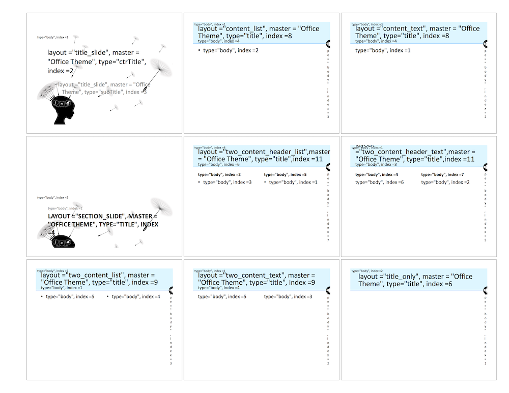

```{r setup, include=FALSE}
knitr::opts_chunk$set(echo = TRUE, message=FALSE, eval=FALSE)
require(ubiquity)
require(deSolve)
require(ggplot2)
require(foreach)
require(doParallel)
require(ubiquity)
require(officer)
require(flextable)
```

## Introduction

Reporting is implemented using the ``officer`` package. Officer provides a lot of control over the generation of both Word and PowerPoint documents. If you feel comfortable programming in R, you can simply use that package directly.  Currently ubiquity has support for generating both PowerPoint and Word reports, and this vingette will go over example scripts for both types of reports. To make a copy of the example scripts in the current working directory run the following:

```{r }
library(ubiquity)
fr = workshop_fetch(section="Reporting", overwrite=TRUE)
```

This should create the following scripts

* ``make_report_PowerPoint.R`` Generates a PowerPoint presentation from an R script
* ``make_report_Word.R`` Generates a Word document from an R script

Then general process for creating a report is:

1. Initialize a report using the function ``system_report_init``
2. Use the functions that begin with ``system_report_slide`` to add content to the report
3. Lastly, save the output using ``system_report_save``


## PowerPoint reports (``make_report_PowerPoint.R``)

Trying to keep track of different slide layouts, placeholder names, and indices can be cumbersome.  The following functions have been created to allow slides to be created easily: 

* ``system_report_init`` - Initialize a new report from a template
* ``system_report_view_layout`` - Generate a PowerPoint file from a template labeling the different elements each slide layout
* ``system_report_fetch`` - Fetch the officer object for a report
* ``system_report_set`` - Set the officer object for a report
* ``system_report_save`` - Save a report to a file
* ``system_report_slide_title`` - Add  a title slide
* ``system_report_slide_section`` - Add a slide separating sections in a presentation
* ``system_report_slide_content`` - Add a slide with a title, subtitle and a single area of content taking up the entire slide
* ``system_report_slide_two_col`` - Add a slide with a title, subtitle, and two columns of content with or without headings


The first five of these functions are general reporting functions and those that begin with ``system_report_slide`` are used to add slides to a PowerPoint report. Examples of how to use these functions can be found in the file ``make_report_PowerPoint.R``, and the text below is intended to document their use in more detail.  

### Creating a report

The first step is to initialize a report:

```{r results="hide", message=FALSE, warning=FALSE}
system_new(file_name="system.txt", system_file="mab_pk", overwrite = TRUE)
cfg = build_system(system_file = "system.txt")
cfg = system_report_init(cfg, rpttype="PowerPoint")
```

This will create a report named ``"default"``. To create multiple reports you
can use the ``rptname`` input and pass that report name to the other
``system_report`` commands as well. The ``rpttype`` input indicates that we
want to create a PowerPoint report. Default document templates will be used,
but custom templates can be used as described below. 

### Content type

With the report created we can begin adding slides. There are several diffent slide formats with different placeholders for content. Each placehodler can contian a different type of content (text, list, image file, etc).  The following list provides the available content types followed by the format of the content:

* ``"text"`` text string of information
* ``"list"`` vector of paired values (indent level and text), eg.  ``c(1, "Main Bullet", 2 "Sub Bullet")``
* ``"imagefile"`` string containing path to image file
* ``"ggplot"`` ggplot object, eg. ``p = ggplot() + ...``
* ``"table"`` list containing the table content and other options with the following elements (defaults in parenthesis):
     - ``table`` Data frame containing the tabular data
     - ``header`` Boolean variable to control displaying the header (``TRUE``)
     - ``first_row`` Boolean variable to indicate that the first row contains header information (``TRUE``)
* ``"flextable"`` list containing flextable content and other options with the following elements (defaults in parenthesis):
     - ``table`` Data frame containing the tabular data
     - ``header_top``, ``header_middle``, ``header_bottom`` (``NULL``)  a list the same names as the data frame names of the tabular data and values with the header text to show in the table 
     - ``merge_header`` (``TRUE``) Set to true to combine column headers with the same information
     - ``table_body_alignment``, ``table_header_alignment`` ("center") Controls alignment
     - ``table_autofit`` (``TRUE``) Automatically fit content, or specify the cell width and height with ``cwidth`` (``0.75``) and ``cheight`` (``0.25``)
     - ``table_theme`` (``"theme_vanilla"``) Table theme
* ``"flextable_object"``  Object created with the flextable package.

For more details on the expected format of slide content see ``?system_report_ph_content``.

### Adding slides to the presentation

First you may want to add a title slide to the presentation:

```{r results="hide", message=FALSE, warning=FALSE}
cfg = system_report_slide_title(cfg, 
           title     = "Generating Inline Reports",
           sub_title = "A Working Example")
```

Next you may want to add an overview of your analysis. The ``content`` slide provides one placeholder that you can fill with any of the above content types.

```{r results="hide", message=FALSE, warning=FALSE}
cfg = system_report_slide_content(cfg, 
           title     = "Single text area",   
           content   = "This vignette provides examples of how to add different types of slide content" )
```

#### Lists

The default content type is text, but you may want to add a list. Lists are formatted as vectors with paired elements. The first element contains the indention level and the second element contains the actual text:

```{r results="hide", message=FALSE, warning=FALSE}
lcont = c(1, "Top level item", 
          2, "This is a sub bullet",
          2, "This is another sub bullet")
cfg = system_report_slide_content(cfg, 
           title        = "Lists are pretty straight forward",      
           content_type = "list",
           content      = lcont)
```

#### Figures

If you are running simulations you may want to put ``ggplot`` figures directly into a report. Consider simulating a single dose in the ``mab_pk`` system:

```{r results="hide", message=FALSE, warning=FALSE}
parameters = system_fetch_parameters(cfg)
cfg = system_zero_inputs(cfg)
cfg = system_set_bolus(cfg, state = "At",
                           times  = c(  0.0),
                           values = c(400.0))

cfg=system_set_option(cfg, group  = "simulation",
                           option = "output_times",
                           value  = seq(0,60,.1))

som = run_simulation_ubiquity(parameters, cfg)
```

Then we can plot the response in ``ggplot``:

```{r results="hide", message=FALSE, warning=FALSE}
myfig = ggplot() + 
        geom_line(data=som$simout, aes(x=ts.days,   y=C_ng_ml), color="red")  +
        xlab("Time (days)")+
        ylab("C (ng/ml) (units)")
myfig = gg_log10_yaxis(myfig, ylim_min=1e3, ylim_max=1e5)
myfig = prepare_figure("present", myfig)
```

Then that figure can be added to a slide:

```{r results="hide", message=FALSE, warning=FALSE}
cfg = system_report_slide_content(cfg, 
           title        = "ggplot objects can be inserted directly", 
           content_type = "ggplot",
           content      = myfig)
```

You can also pull image content from files as well using the ``imagefile`` content type. 

```{r results="hide", message=FALSE, warning=FALSE}
cfg = system_report_slide_content(cfg, 
           title        = "Images can be inserted from files", 
           sub_title    = "But the image should have the same aspect ratio as the placeholder", 
           content_type = "imagefile",
           content      = system.file("ubinc", "images", "report_image.png", package="ubiquity"))
```

The benefit of using ``ggplot`` is that it will automatically size the image to the dimensions of the placeholder. To use an image file the image file needs to have the same aspect ratio as the placeholder you want to put it in. 

#### Tables

Tabular data can be include too. The simplest method is to use the ``table`` content type and supply a list with an element named ``table`` containing a data frame with the tabular information you want to display:

```{r results="hide", message=FALSE, warning=FALSE}
tcont = list()
tcont$table = parameters
cfg = system_report_slide_content(cfg, 
           title        = "Simple Tables", 
           content_type = "table",    
           content      = tcont)
```

This may not be the most attractive way to display tabular information, and for smaller tables it may be a bit poorly formatted. As an alternative the ``flextable`` package can be used by specifying that content type:

```{r results="hide", message=FALSE, warning=FALSE}
tcont = list()
tcont$table = parameters
cfg = system_report_slide_content(cfg, 
           title        = "Flextables", 
           content_type = "flextable",    
           content      = tcont)
```

To provide a little more formatting, two column slides are provided. The ``content_type`` argument indicates the type of text that can be included. It  should be either ``"list"`` or ``"text"``. 

```{r results="hide", message=FALSE, warning=FALSE}
cfg = system_report_slide_two_col(cfg,
        title                  = "Two columns of plain text",      
        sub_title              = "Subtitle", 
        content_type           = "text", 
        left_content           = "Left Side",
        right_content          = "Right Side")

cfg = system_report_slide_two_col(cfg,
       title                  = "Two Col Text w/Headers",      
       sub_title              = "Two columns of text with headers",
       content_type           = "list", 
       right_content          = c(1, "Right Text"),
       left_content_type      = "list",
       left_content           = c(1, "Left Text"),
       right_content_type     = "list")
```

The main content type can be overwritten if the left or right content is to contain a table or figure it can be overwritten. 

```{r results="hide", message=FALSE, warning=FALSE}
cfg = system_report_slide_two_col(cfg,
       title                  = "Two columns of lists",      
       sub_title              = NULL, 
       content_type           = "list", 
       left_content           = lcont,
       right_content_type     = "flextable",
       right_content          = tcont)
```

You can specify column headers if you like:

```{r results="hide", message=FALSE, warning=FALSE}

cfg = system_report_slide_two_col(cfg,
       title                  = "Two Col Text w/Headers",      
       sub_title              = "Two columns of text with headers",
       content_type           = "text", 
       right_content          = "Right Text",
       left_content_type      = "text",
       left_content           = "Left Text",
       left_content_header    = "Left Header",
       right_content_header   = "Right Header")

cfg = system_report_slide_two_col(cfg,
       title                  = "Two Col Text w/Headers",      
       sub_title              = "Two columns of text with headers",
       content_type           = "list", 
       right_content          = c(1, "Right Text"),
       left_content_type      = "list",
       left_content           = c(1, "Left Text"),
       left_content_header    = "Left Header",
       right_content_type     = "list",
       right_content_header   = "Right Header")
```

Headers can be can be ``text``, ``imagefile``, ``ggplot``, ``table`` or ``flextable``.

```{r results="hide", message=FALSE, warning=FALSE}
cfg = system_report_slide_two_col(cfg,
       title                  = "ggplot vs imagefile",      
       sub_title              = NULL, 
       content_type           = "list", 
       left_content_header    = "Image file",
       left_content_type      = 'imagefile',
       left_content           = system.file("ubinc", "images", "report_image.png", package="ubiquity"),
       right_content_header   = "ggplot object",
       right_content_type     = "ggplot",
       right_content          = myfig)
```

The ``flextable`` content type is intended to provide a quick way to turn a data frame into a flextable, but if you want to create more complex tables you can use the ``flextable_object`` content type. Consider the two data frames containing the data and header information:

```{r results="hide", message=FALSE, warning=FALSE}
data = data.frame(property = c("mean",   "variance"),
                  Cmax     = c(2,         0.1),
                  AUCinf   = c(22,       0.21),
                  AUClast  = c(22,       0.21))

header = list(property = c("",              ""),
              Cmax     = c("Cmax",          "ng/ml"),
              AUCinf   = c("AUCinf",        "mL/hr"),
              AUClast  = c("AUClast",       "mL/hr"))
```

Next we create the flextable object:

```{r results="hide", message=FALSE, warning=FALSE}
library(magrittr)
library(flextable)
ft = flextable::flextable(data)                     %>% 
     flextable::delete_part(part = "header")        %>%
     flextable::add_header(values =as.list(header)) %>%
     flextable::theme_zebra()
```

And then we can use that directly as content:

```{r results="hide", message=FALSE, warning=FALSE}
cfg = system_report_slide_content(cfg,
       title        = "Userdefined Flextable",
       sub_title    = "flextable_object",    
       content_type = "flextable_object", 
       content      = ft)
```


### Saving slides 

Finally, after you have added all of your sldies, you will want to save them to a file:

```{r results="hide", message=FALSE, warning=FALSE}
system_report_save(cfg, output_file = "report_vignette.pptx")
```

## Word reports (``make_report_Word.R``)

To generate word reports the following functions are used. The first five are
the same general reporting function from above and the remaining three are
specifically used for Word documents:

* ``system_report_init`` - Initialize a new report from a template
* ``system_report_view_layout`` - Generate a PowerPoint file from a template labeling the different elements each slide layout
* ``system_report_fetch`` - Fetch the officer object for a report
* ``system_report_set`` - Set the officer object for a report
* ``system_report_save`` - Save a report to a file
* ``system_report_doc_add_content`` - Add different report elements to a document (text, figures, tables, etc)
* ``system_report_doc_format_section`` - Change section formatting (e.g. go from portrait to landscape)
* ``system_report_doc_set_ph`` - Define placeholder content mapping information

### Creating a report

Like with PowerPoint reports above, we begin by initializing a report. The
only difference is that we are using the ``"Word"`` report type. 

```{r results="hide", message=FALSE, warning=FALSE, eval=FALSE}
cfg = system_report_init(cfg, rpttype="Word")
```

### Content type

Similar to the slide functions above, content is added to Word reports using
the function ``system_report_doc_add_content``. When calling this function we
must specify a ``content_type`` and corresponding ``content``. The following
list provides the available content types followed by a description of the format of the content. 

* ``"break"`` content is (``NULL``) and a page break will be inserted here
* ``"toc"`` generates the table of contents, and content is a list 
     - ``"level"`` number indicating the depth of the contents to display (``3``)
* ``"text"`` content is a list containing a paragraph of text with the following elements
     - ``"text"`` string containing the text content either a string or the output of ``"fpar"`` for formatted text.
     - ``"style"`` string containing the style either ``"normal"``, ``"code"``, ``"h1"``, ``"h2"``, ``"h3"``
     - ``"format"`` string containing the format, either ``"text"`` (default ``NULL`` assumes ``"text"`` format), ``"fpar"`` (output of ``fpar`` formatted text), or ``"md"`` (text with Markdown to be rendered internally) 
* ``"imagefile"`` content is a list containing information describing an image file with the following elements
     - ``image`` string containing path to image file
     - ``caption`` caption of the image
     - ``caption_format`` string containing the format, either ``"text"``, ``"fpar"``, or ``"md"`` (default ``NULL`` assumes ``"text"`` format)
     - ``key`` unique key for cross referencing e.g. "FIG_DATA" (``NULL``) 
     - ``height`` height of the image (``NULL``)
     - ``width`` width of the image (``NULL``)
* ``"ggplot"`` content is a list containing an image from a ggplot object, (eg. p = ggplot() + ....) with the following elements
     - ``image`` ggplot object
     - ``caption`` caption of the image
     - ``caption_format`` string containing the format, either ``"text"``, ``"fpar"``, or ``"md"`` (default ``NULL`` assumes ``"text"`` format)
     - ``key`` unique key for cross referencing e.g. "FIG_DATA" (``NULL``) 
     - ``height`` height of the image (``NULL``)
     - ``width`` width of the image (``NULL``)
* ``"table"`` content is a list containing the table content and other options with the following elements
     - ``table`` data frame containing the tabular data
     - ``caption`` caption of the table 
     - ``caption_format`` string containing the format, either ``"text"``, ``"fpar"``, or ``"md"`` (default ``NULL`` assumes ``"text"`` format)
     - ``key`` unique key for cross referencing e.g. "TAB_DATA" (``NULL``) 
     - ``header`` Boolean variable to control displaying the header (``TRUE``)
     - ``first_row`` Boolean variable to indicate that the first row contains header information (``TRUE``)
* ``"flextable"`` content is a list containing flextable content and other options with the following elements (defaults in parenthesis):
     - ``table`` Data frame containing the tabular data
     - ``caption`` caption of the table 
     - ``caption_format`` string containing the format, either ``"text"``, ``"fpar"``, or ``"md"`` (default ``NULL`` assumes ``"text"`` format)
     - ``key`` unique key for cross referencing e.g. "TAB_DATA" (``NULL``) 
     - ``header_top``, ``header_middle``, ``header_bottom`` (``NULL``)  a list with the same names as the data frame names of the tabular data and values with the header text to show in the table 
     - ``merge_header`` (``TRUE``) Set to true to combine column headers with the same information
     - ``table_body_alignment``, ``table_header_alignment`` ("center") Controls alignment
     - ``table_autofit`` (``TRUE``) Automatically fit content, or specify the cell width and height with ``cwidth`` (``0.75``) and ``cheight`` (``0.25``)
     - ``table_theme`` (``"theme_vanilla"``) Table theme
* ``"flextable_object"``  content is a list specifying the a user defined flextable object with the following elements:
     - ``caption`` caption of the table (``NULL``)  
     - ``ft`` flextable object
     - ``key`` unique key for cross referencing e.g. "TAB_DATA" (``NULL``) 

Text can be specified in different formats: ``"text"`` indicates plain text,
``"fpar"`` is formatted text defined by the ``fpar`` command from the
``officer`` package, and ``"md"`` is text formatted in markdown
format (``?md_to_officer`` for markdown details).

### Adding content to the document

Next we can start by adding the table of contents to the document:

```{r results="hide", message=FALSE, warning=FALSE, eval=FALSE}
cfg = system_report_doc_add_content(cfg, 
  content_type  = "toc",
  content       = list(level=1))
```

#### Different types of text

We can begin by creating a header. You can add three levels of headers using
the style element in the content (``"h1"``, ``"h2"``, and ``"h3"``).

```{r results="hide", message=FALSE, warning=FALSE, eval=FALSE}
cfg = system_report_doc_add_content(cfg, 
  content_type  = "text",
  content       = list(style   = "h1",
                       text    = "This will insert a level 1 header"))
```

You can also add text using the ``"normal"`` and ``"code"`` styles. The
content contains the optional format. If you do not specify a format, it will
assume you're using plain text. 

```{r results="hide", message=FALSE, warning=FALSE, eval=FALSE}
cfg = system_report_doc_add_content(cfg, 
  content_type  = "text",
  content       = list(style   = "normal",
                       text    = "This is plain text"))
```

Formatted text can be created using two methods.First you can use the ``fpar``
command from ``officer``:

```{r results="hide", message=FALSE, warning=FALSE, eval=FALSE}
fpartext = fpar(
ftext("Formatted text can be created using the ", prop=prop=officer::fp_text()),
ftext("fpar ", prop=officer::fp_text(color="green")),
ftext("command from the officer package.", prop=prop=officer::fp_text()))

cfg = system_report_doc_add_content(cfg, 
  content_type  = "text",
  content       = list(style   = "normal",
                       format  = "fpar",
                       text    = fpartext))
```

Lastly you can specify formatting using Markdown. This also includes
options for font colors and font families. The following text demonstrates the different types of Markdown. For more information see ``?md_to_officer``.  

```{r results="hide", message=FALSE, warning=FALSE, eval=FALSE}
mdtext = "Text can be specified in markdown format as well. You can specify
*bold text*, **italicized text**, ^superscripts^ and ~subscripts~. These can
be combined as well *H*~*2*~*0*.

You can change colors to  <color:red>red</color>, <color:blue>blue</color>, etc and
change the <shade:#33ff33>shading</shade>. Again these can be combined
<shade:orange><color:green>both color and shading</color></shade>. You can also
change the font to things like <ff:symbol>*symbol*</ff>."

cfg = system_report_doc_add_content(cfg, 
  content_type  = "text",
  content       = list(style  = "normal",
                       format = "md",
                       text   = mdtext))
```

#### Including figures

First we create an image (ggplot object and file):

```{r results="hide", message=FALSE, warning=FALSE, eval=FALSE}
p = ggplot() + annotate("text", x=0, y=0, label = "picture example")
imagefile = tempfile(pattern="image", fileext=".png")
ggsave(filename=imagefile, plot=p, height=5.15, width=9, units="in")
```

Figures can be added by either referencing them from a file or inserting a ggplot object directly. This is done by specifying the content type ``"imagefile"`` or ``"ggplot"``, respectively. The content contains the filename or ggplot object and other information such as the image width, caption text, etc. 

```{r results="hide", message=FALSE, warning=FALSE, eval=FALSE}
cfg = system_report_doc_add_content(cfg, 
  content_type  = "imagefile",
  content       = list(image   = imagefile,
                       caption = "This is an image file"))

cfg = system_report_doc_add_content(cfg, 
  content_type  = "ggplot",
  content       = list(image   = p,
                       caption = "This is a ggplot image"))
```

#### Tables

Tables can be added in two ways. The simplest is to create a table in Word
using a predefined style in the template file. First a list is created to
contain the table and metadata about that table. This list is then passed into
``system_report_doc_add_content`` with the ``"table"`` content type specified:

```{r results="hide", message=FALSE, warning=FALSE, eval=FALSE}
tc = list()
tc$table = data.frame(Parameters = c("Vp", "Cl", "Q", "Vt"),
                      Values     = 1:4,
                      Units      = c("L", "L/hr", "L/hr", "L") )
tc$header    = TRUE 
tc$first_row = TRUE 
tc$caption = "This is a table"

cfg = system_report_doc_add_content(cfg, 
  content_type  = "table",
  content       = tc)
```

Tables can also be created using the ``flextable`` package.  A list can be
created to contain the tabular data and other information as before. The
benefit here is that you will have more control over the table formatting:

```{r results="hide", message=FALSE, warning=FALSE, eval=FALSE}
tcf = list()
tcf$caption = "This is a flextable"
tcf$table = data.frame(Parameters = c("Vp", "Cl", "Q", "Vt"),
                       Values     = 1:4,
                       Units      = c("L", "L/hr", "L/hr", "L") )
tcf$header_top   = 
     list(Parameters     = "Name", 
          Values         = "Value",
          Units          = "Units")

tcf$cwidth        = 0.8 
tcf$table_autofit = TRUE
tcf$table_theme   ='theme_zebra'

cfg = system_report_doc_add_content(cfg, 
  content_type  = "flextable",
  content       = tcf)
```

Similar to the presentation components above, you can create more complex tables by using the 
``flextable_object`` content type:

```{r results="hide", message=FALSE, warning=FALSE, eval=TRUE}
library(magrittr)
library(flextable)

data = data.frame(property = c("mean",   "variance"),
                  Cmax     = c(2,         0.1),
                  AUCinf   = c(22,       0.21),
                  AUClast  = c(22,       0.21))

header = list(property = c("",              ""),
              Cmax     = c("Cmax",          "ng/ml"),
              AUCinf   = c("AUCinf",        "mL/hr"),
              AUClast  = c("AUClast",       "mL/hr"))

# This creates a flextable object:
ft = flextable::flextable(data)                     %>% 
     flextable::delete_part(part = "header")        %>%
     flextable::add_header(values =as.list(header)) %>%
     flextable::theme_zebra()
```

The code above creates the following flextable:

```{r eval=TRUE, message=FALSE, warning=FALSE, echo=FALSE}
knitr::knit_print(ft)
```

To insert this into the document we need to supply a list containing both the caption and the flextable object. The reference key field is optional:

```{r results="hide", message=FALSE, warning=FALSE, eval=FALSE}
tcfo = list(caption = "This is a flextable object",
            key     = "TAB_FTO",  
            ft      = ft)

cfg = system_report_doc_add_content(cfg, 
  content_type  = "flextable_object",
  content       = tcfo)
```

To use markdown in the flextable object you can use the function ``md_to_oo``. The following code will format the table above: 

```{r results="hide", message=FALSE, warning=FALSE, eval=TRUE}
ftf = flextable::flextable(data)                                                                       %>% 
      flextable::delete_part(part = "header")                                                          %>%
      flextable::add_header(values =as.list(header)) %>%
      flextable::compose(j    = "Cmax",                                                    
                        part  = "header",                                                          
                        value = c(md_to_oo("*C*~*max*~")$oo, md_to_oo("*ng/ml*")$oo))                  %>%
      flextable::compose(j    = "AUClast",                                                    
                        part  = "header",                                                          
                        value = c(md_to_oo("*AUC*~*last*~")$oo, md_to_oo("*ml\U00B7hr*^*-1*^")$oo))         %>%
      flextable::compose(j    = "AUCinf",                                                    
                        part  = "header",                                                          
                        value = c(md_to_oo("*AUC*~*inf*~")$oo, md_to_oo("*ml\U00B7hr*^*-1*^")$oo))          %>%
      flextable::compose(j     = "property",                                                         
                         i     = match("mean", data$property),                        
                         part  = "body",                                                          
                         value = c(md_to_oo("Mean (<ff:symbol>m</ff>)")$oo))                            %>%
      flextable::compose(j     = "property",                                                         
                         i     = match("variance", data$property),                        
                         part  = "body",                                                          
                         value = c(md_to_oo("Variance (<ff:symbol>s</ff>^2^)")$oo))                     %>%
      flextable::autofit()                                                                             %>%
      flextable::theme_zebra()
```


This produces the following formatted output (note that the symbols will not be rendered correctly here but will be rendered correclty in Word):

```{r eval=TRUE, message=FALSE, warning=FALSE, echo=FALSE}
knitr::knit_print(ftf)
```

Which is inserted into the document in the same way. 

```{r results="hide", message=FALSE, warning=FALSE, eval=FALSE}
tcfo = list(caption = "This is a flextable object",
            key     = "TAB_FTO_FORMATTED",
            ft      = ftf)
cfg = system_report_doc_add_content(cfg, 
  content_type  = "flextable_object",
  content       = tcfo)
```


#### Placeholders                 

You can include placeholders in your documents. These can be in the template document itself or in the text you're adding to the document. For example you can create placeholder text called: ``===PHName===`` in your document and it can be replaced by the desired text in the document. A placeholder is a unique string of text surrounded by ``===`` and ``===``. If the placeholder is in your template document, it may not work correctly if you type the text into word. This is because while a string may appear to be a contiguous in Word, it may not be so in the underlying XML code. To ensure the string is contiguous **you should type the placeholder text into a text editor, copy and paste it into template word**. Next you can define the replacement text using ``system_report_doc_set_ph``:

```{r results="hide", message=FALSE, warning=FALSE, eval=FALSE}
cfg = system_report_doc_set_ph(cfg, 
      ph_content  = "Jill Smith" ,
      ph_name     = "PHName", 
      ph_location = "header")
```

The ``ph_location`` can be either ``"header"``, ``"footer"``, or ``"body"``. Note that to avoid conflicts with markdown formatting the ``ph_name`` should only contain letters and numbers. 

#### Page orientation and columns 

To alter the orientation of the page (portrait vs. landscape) or the number of columns you would use ``system_report_doc_format_section``. When this function is called it applies to all of the added content since the last time this function was called. For example to switch to landscape for a figure we must end the current section:

```{r results="hide", message=FALSE, warning=FALSE, eval=FALSE}
cfg = system_report_doc_format_section(cfg, section_type="continuous")
```

Then we can add our figure

```{r results="hide", message=FALSE, warning=FALSE, eval=FALSE}
p = ggplot() + annotate("text", x=0, y=0, label = "picture example")

cfg = system_report_doc_add_content(cfg, 
  content_type  = "ggplot",
  content       = list(image   = p,
                       height  = 2.5,
                       width   = 9,
                       caption = "This is a landscape figure"))
```

Next we can apply the apply the landscape orientation to the figure.

```{r results="hide", message=FALSE, warning=FALSE, eval=FALSE}
cfg = system_report_doc_format_section(cfg, section_type="landscape", h=8, w=10)
```


The following section types are available.  ``"columns"``,  ``"continuous"``,
``"landscape"``, ``"portrait"``, ``"columns"``,  or  ``"columns_landscape"``.


Finally, after you have added all of content to your Word report, you will
want to save it to a file.

```{r results="hide", message=FALSE, warning=FALSE}
system_report_save(cfg, output_file = "report_vignette.docx")
```

## Using custom organizational templates

To use a custom template for your organization you need to do the following: 

1. Create a template with the appropriate slide masters (PowerPoint) or styles (Word)
2. Generate a layout file with mapping information for your template
3. Customize the functions in the organizational template script
4. Initialize a report indicating that you want to use this new template and add elements to the report


#### Creating a PowerPoint template for your organization

Using your organizational template create slide masters below with the content elements to the right. The title element of the ``title_slide`` and ``section_slide`` should be of the type ``ctrTitle``. For the rest of the slides the title elements should be of the type ``title``, and the other elements should simply be of type ``body``. The format of the body elements should be plain text unless identified parenthetically below.


| Master layout name        | Content elements                                                                   | 
|:--------------------------|:-----------------------------------------------------------------------------------|
| title_slide               | title, subtitle                                                                    |
| section_slide             | title, subtitle                                                                    | 
| content_text              | title, subtitle, main content                                                      |
| content_list              | title, subtitle, main content (list)                                               |
| two_content_list          | title, subtitle, left, right, left body (list), right body (list)                  |
| two_content_text          | title, subtitle, left, right, left body, right body                                |
| two_content_header_list   | title, subtitle, left header, right header, left body (list), right body (list)    |
| two_content_header_text   | title, subtitle, left header, right header, left body, right body                  |
| title_only                | title                                                                              |


#### Creating a Word template for your organization

In your Word organizational template you will need to create a Word template file with the
following styles:

* Normal - Normal text in the body of your document
* Code - Text with a fixed-width font (such as courier)
* TOC - Format of table of contents
* Heading_1 - Level 1 heading
* Heading_2 - Level 2 heading
* Heading_3 - Level 3 heading
* Table - General/plain table format
* Table_Caption - Format of captions for tables
* Figure_Caption- Format of captions for figures


#### Creating the layout file for the PowerPoint template

Each element in a master is identified with an index number (`index`) and placeholder label (`ph_label`). These values are asigned as the master slide is built, so it can be difficult to find this information through PowerPoint. If you named your template ``mytemplate.pptx``, then you can have ubiquity produce a slide deck with the masters annotated so you can identify these values:

```{r results="hide", message=FALSE, warning=FALSE, eval=FALSE}
cfg = build_system()
cfg = system_report_init(cfg, template="mytemplate.pptx")
cfg = system_report_view_layout(cfg)
```

This should create a file called ``layout.pptx`` that has the ``layout`` name of each slide master in the title. Both the ``ph_label`` and ``index`` of each element will be identified. These slides should look something like:

{width=100%}

#### Creating the layout file for the Word template

After you create your Word template you can create a layout file for it. If
you named your template ``mytemplate.docx``, then you can create the layout
file using the following:

```{r results="hide", message=FALSE, warning=FALSE, eval=FALSE}
cfg = build_system()
cfg = system_report_init(cfg, template="mytemplate.docx")
cfg = system_report_view_layout(cfg)
```

This should create a file called ``layout.docx`` that has an example of each style in the template. It will have the names of the styles as well that will be used to define mapping information in the organizational slide. 

#### Mapping your layout to ubiquity functions

Next you need to map information in your document templates. This will be done with the ``myOrg`` template:

```{r results="hide", message=FALSE, warning=FALSE, eval=FALSE}
tr = system_fetch_template(cfg, template="myOrg")
```

This should create the file ``myOrg.R`` in the current directory. In this file has two functions defined:  modify the  ``org_pptx_meta`` contains the mapping information for PowerPoint templates and ``org_docx_meta`` contains the same information for Word templates. The comments in ``myOrg.R`` can be useful in understanding how the content should be modified. 

#### PowerPoint template mapping

In the ``myOrg.R`` file you need to edit the ``org_pptx_meta`` function. The list ``meta`` contains default mapping information. You should open the ``layout.pptx`` generated above and alter the values in ``meta`` to match the values in the layout. 

#### Word template mapping

Similarly, you will need to edit the ``org_docx_meta`` function and put the style names from your Word document into the appropriate location in the ``meta`` list defined in that function. You can also customize how figure and table captions are displayed. Because of how markdown is created, elements using the ``"md"`` format need to have their default font attributes defined. You need to do this for each of the styles above. For example the following defines the default text properties for the ``Normal`` style:

```
meta[["md_def"]][["Normal"]] = list(
        color          = "black",
        font.size      = 12,
        bold           = FALSE,
        italic         = FALSE,
        underlined     = FALSE,
        font.family    = "Cambria (Body)",
        vertical.align = "baseline",
        shading.color  = "transparent")
```

To do this open each style in Word and set the elements in the list to the values in Word. 

#### Using your own template

To use your own template you simply need to source the ``myOrg.R`` file at the top of your script. For PowerPoint templates, initialize the report using your own template (``mytemplate.pptx``) and the meta information returned from ``org_pptx_meta``:

```{r results="hide", message=FALSE, warning=FALSE, eval=FALSE}
source("myOrg.R")
cfg = system_report_init(cfg  = cfg, 
            meta     = org_pptx_meta(),
            template = "mytemplate.pptx")
```

For word reports you can use the word equivalents:

```{r results="hide", message=FALSE, warning=FALSE, eval=FALSE}
source("myOrg.R")
cfg = system_report_init(cfg  = cfg, 
            meta     = org_docx_meta(),
            template = "mytemplate.docx")
```

Note that you do not have to specify the ``repttype`` because that is inferred from the ``template``. Now you can use the functions outlined above to add content to these reports.

## Integration with ubiquity workflows

Ubiquity provides reporting functionality for the different workflows by allowing the results of those workflows to be appended to open reports. 

### Parameter estimation

After performing a parameter estimation and archiving the estimation with a
specified analysis name, that analysis name can be used to retrieve the
results and append them to an open report using ``system_report_estimation``.
This function supports both PowerPoint and Word reports.

```{r results="hide", message=FALSE, warning=FALSE, eval=FALSE}
cfg = system_report_estimation(cfg=cfg, analysis_name="analysis_name")
```

### Non-compartmental analysis (NCA)

The results of NCA can be appended to a report using the ``system_report_nca``
function. This function supports both PowerPoint and Word reports.

```{r results="hide", message=FALSE, warning=FALSE, eval=FALSE}
cfg = system_report_nca(cfg, analysis_name = "default")
```

## Modifying reports directly with ``officer``

Sometimes the functions provided above are not sufficient to get what you want done. It may be more convenient to directly use the ``officer`` functions to add content or modify your report. If you have report initialized, you can pull that report out of the ubiquity system object using ``system_report_fetch``:

```{r results="hide", message=FALSE, warning=FALSE, eval=FALSE}
rpt = system_report_fetch(cfg)
```

Now ``rpt`` is an ``officer`` object. If it contains a PowerPoint presentation you can use all of the ``officer`` functions for PowerPoint to modify that object. If it's a Word document you can use the Word functions from ``officer`` to modify/add content. Once you're done making changes you can put the object back using ``system_report_set``:

```{r results="hide", message=FALSE, warning=FALSE, eval=FALSE}
cfg = system_report_set(cfg, rpt = rpt) 
```

Then you can continue using the ubiquity functions above or save the document.
